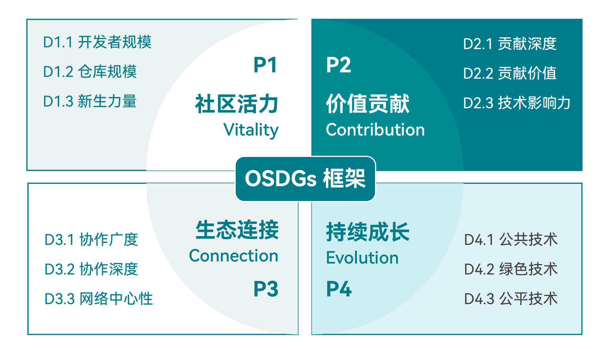

# Data Section

## 1. Overview of the Data Section

### 1.1 Open Source Development Goals: From Global Vision to Chinese Practice

Open source has evolved from a software development model into foundational public infrastructure underpinning digital civilization. To systematically assess the comprehensive value of open source to society, the economy and technological progress, the Open Source Innovation Committee of the China Association for Science and Technology (CAST) UN Consultative Body formally proposed the "Open Source Development Goals (OSDGs)" in 2025 — a global assessment framework inspired by the UN Sustainable Development Goals (SDGs) and designed specifically for the open source ecosystem.

OSDGs aim to answer a fundamental question: how can open source contribute to a fairer, more efficient and more sustainable world? Moving beyond traditional single-dimension metrics such as "lines of code" or "Star counts", OSDGs focus on the deeper value of open source in promoting knowledge sharing, empowering marginalized groups, advancing green computing and safeguarding digital sovereignty. The framework comprises three pillars:

Planet: assesses the role of open source in energy-efficiency optimization, resource conservation and green technology innovation;

People: measures the contribution of open source to inclusive education, skills upgrading, community inclusiveness and talent diversity;

Governance: examines how open source builds mechanisms for joint standard-setting, rule transparency, collaboration fairness and ecosystem health.

**Figure 2-1 The overall OSDGs framework**

**Source:** The 2025 Global Open Source Development Report

This year, the 2025 China Open Source Annual Report adopts the OSDGs framework comprehensively for the first time, structurally restructuring its data section. Grounded in China's realities, it translates the global vision into a localized action guide. This report focuses on the following core concerns:

The role and quality of Chinese developers' contributions in the global open source collaboration network;

How open source helps drive the development of China's new quality productive forces and the self-reliance and controllability of key technologies;

Against the backdrop of coordinated regional development, the differentiated paths and collaboration potential of provincial open source ecosystems;

The cultivation mechanisms and depth of participation of universities and young developers as "future contributors".

By embedding Chinese practice into the global coordinate system of OSDGs, we can benchmark against internationally advanced levels while highlighting the open source development path with Chinese characteristics, providing insights that combine strategic height with practical value for policymaking, industrial layout and community building.

### 1.2 Indicator System and Data Sources

To scientifically and objectively measure the achievement of each OSDG dimension, this report constructs a three-tier progressive open source evaluation indicator system, originating from The 2025 Global Open Source Development Report and localized to China's ecosystem characteristics. The system follows the logical thread of "activity—quality—influence", deepening layer by layer:

#### 1.2.1 Tier 1: Activity

Activity is the foundation of the evaluation, used to filter out developers and projects genuinely engaged in collaboration. This report defines five types of core contribution behaviors as the constituents of activity:

OI (Open Issue): opening an issue to raise a problem or requirement;

ID (Issue Discussion): participating in issue discussions, providing feedback or solutions;

OPR (Open Pull Request): submitting a code merge request, contributing code or documentation;

PRR (Pull Request Review): reviewing others' code to ensure quality;

MPR (Merge Pull Request): merging code requests to complete integration.

Only when an account completes any of the above behaviors within the statistical period is it recognized as an "active developer". This criterion effectively excludes the interference of low-participation behaviors such as merely "Starring" or "Forking", ensuring that subsequent analysis is based on genuine collaboration data.

#### 1.2.2 Tier 2: Quality of Contribution

After identifying active participants, the value of their contributions must be further assessed. This report employs the "community OpenRank" algorithm, focusing on the collaboration network within a single project. Based on dimensions such as behavior type (e.g., MPR carries more weight than OI), interaction targets (interactions with core maintainers carry higher weight) and adoption rate, the algorithm computes a developer's relative contribution quality within a specific project, thereby identifying true "core contributors".

#### 1.2.3 Tier 3: Influence

Finally, the contributions of individuals or organizations must be positioned within the global open source ecosystem. This report employs the "global OpenRank" algorithm, building a global developer-project collaboration graph covering billions of nodes. Drawing on the idea of PageRank, the algorithm holds that "projects/developers followed or collaborated with by high-quality contributors also have higher influence themselves". Through this algorithm, a unified influence ranking across projects, organizations and regions can be generated, used to evaluate the strategic position of enterprises, universities, administrative regions and even countries in the global open source ecosystem.

#### 1.2.4 Data Sources and Processing

The data collection and analysis of this study rely on the [OpenDigger open source project ](https://github.com/X-lab2017/open-digger)and its corresponding [online service platform](https://open-digger.cn/); all behavioral data is systematically collected and processed through this platform.

The time window is January 1, 2025 to December 31, 2025. Leveraging the multi-dimensional label system built on the OpenDigger platform (including 34 Chinese provincial-level administrative regions, 1,000+ enterprises, 200+ technology domains, etc.), this report achieves seamless penetration analysis from global macro trends to China's micro ecosystem. All raw data and analysis code have been open-sourced, ensuring the transparency, verifiability and reproducibility of the research.

OpenDigger is an open data infrastructure dedicated to promoting the transparency and measurability of the global open source ecosystem. The project was originally initiated by the X-lab Open Laboratory and incubated within the Mulan Open Source Community. Its technical architecture integrates research outcomes from universities, research institutes, enterprises and other organizations. To promote the transparency, measurability and sustainable development of the open source ecosystem, OpenDigger is building an open, neutral, multi-stakeholder global governance architecture, committed to becoming a Public Digital Infrastructure serving global open source governance.

In this report, the core evaluation metric — the OpenRank North Star Metric — is designed based on the multi-dimensional data system built on OpenDigger. OpenRank is the world's first systematic and original open source standard system. It has been included by the Ministry of Industry and Information Technology in the "Announcement of Typical Cases for the Promotion and Application of Group Standards in 2024" (MIIT Kehan [2025] No. 19), reflecting its authority and practical value.

As shown in the figure, the OpenRank indicator system starts from the two-dimensional perspective of "developer-project" and constructs a quadrant model comprising two major dimensions — OpenRank Contribution Impact and OpenRank Influence — comprehensively depicting the open source participation quality and social value of individuals and projects.

**Figure 2-2 OpenRank North Star Metric quadrant diagram**

**Source:** OpenDigger platform documentation

Meanwhile, as one of the core outputs of the OpenDigger platform, OpenRank features the following five major characteristics:

Global perspective: comprehensively considers developers' behavioral trajectories across multiple platforms and projects;

Emphasis on influence: focuses not only on the quantity of contributions but also on technological dissemination power and position in the collaboration network;

Encourages collaborative interaction: values interactive behaviors such as Issues, Pull Requests and comments;

Encourages long-term participation: introduces a time-decay mechanism to incentivize sustained contribution;

Robust and highly scalable: supports unified evaluation across platforms, languages and domains.

For more detailed documentation, please refer to the [OpenDigger user documentation](https://open-digger.cn/docs/user-docs/intro).

This report analyzes data from multiple open source collaboration platforms including GitHub, Gitee, AtomGit/GitCode and GitLab. As of the end of 2025, GitHub has accumulated 25 million active developers; domestic platforms such as Gitee/AtomGit/GitCode have accumulated nearly 10 million active developers; GitLab has accumulated nearly 800,000 active developers. In terms of active repositories, GitHub exceeds 36 million, domestic platforms such as Gitee/AtomGit/GitCode exceed 26 million, and GitLab approaches 730,000.

Compared with previous China Open Source Annual Reports, an important change this year is the addition of model platform data, represented by Hugging Face, to more fully observe the evolution of the global and local open source model ecosystems. As of the end of 2025, the Hugging Face platform has accumulated nearly 2.34 million models and 470,000 model publishers, increasing by 1.17 million models and 210,000 publishers respectively compared with the end of 2024, with growth rates of 100% and 80% respectively. Meanwhile, as of the end of 2025, more than 160,000 developers on the platform have engaged in collaboration behaviors, touching more than 210,000 models cumulatively, up approximately 60% and 140% respectively from 2024. Here, "collaboration behaviors" mainly refers to interactive actions such as posting or commenting, editing and emoji feedback in model repositories. This shows that model platforms represented by Hugging Face are no longer just model publishing and distribution platforms, but are evolving into key infrastructure that simultaneously carries model supply expansion, developer collaboration and interaction, and ecosystem feedback loops.

### 1.3 Overall Structure of the Data Section

To systematically present a panoramic view of China's open source ecosystem under the OSDGs framework, this data section consists of four core parts, forming a complete logical loop of "observation—benchmarking—deep dive—outlook":

**Part II:** Open Source Ecosystem Observation System. This part builds four dynamic maps, depicting the fundamentals of China's open source ecosystem from four dimensions — space, actors, technology and talent:

Open Source Activity Map: based on Activity and OpenRank indicators, it shows the intensity of open source participation across major countries/regions globally;

Open Source Contribution Map: based on Activity and OpenRank indicators, it reveals the geographic distribution and organizational affiliation of high-value contributors;

Open Source Technology Map: it tracks the technological evolution and project cluster distribution in key domains such as artificial intelligence, cloud-native, foundational software and RISC-V;

Open Source Talent Map: combining developer tags, developer growth trajectories and OSPP activity data, it depicts the origins, flows and growth paths of the new generation of open source forces.

**Part III:** Open Source Influence Rankings. Building on the observations, this part releases four authoritative rankings to set benchmarks and guide direction:

Administrative Region Influence Ranking: quantitatively assesses the comprehensive influence of countries and Chinese provinces/cities in the global open source ecosystem, serving regional digital economy development evaluation;

Open Source Enterprise Influence Ranking: covers domestic and international tech enterprises and non-profit organizations, reflecting their open source strategic investment, project leadership and community leadership;

Open Source Project Influence Ranking: based on the global OpenRank indicator, it selects the year's most influential open source projects, covering foundational software, AI frameworks, development tools, databases and other categories, comprehensively reflecting projects' ecological position and collaboration breadth;

New Force Open Source Project Ranking: focuses on new projects first released and outstandingly performed during 2025, capturing the sparks of innovation and future potential.

**Part IV:** Open Source Thematic Analysis

In-depth penetrating research is conducted on key annual issues:

Annual AI Large Model Analysis: based on full Hugging Face data, it systematically analyzes the open source large model ecosystem, new collaboration models, license challenges, domestic substitution paths and new paradigms of community governance;

Annual Open Source Promotion Plan (OSPP) Analysis: based on OSPP activity data in recent years, it evaluates the effectiveness of university talent cultivation, project completion quality and community feedback mechanisms, exploring sustainable development paths for open source education.

Overall, the 2025 data section takes OSDGs as its guiding framework and the three major parts as its body, both inheriting the global consensus and deeply cultivating the Chinese soil, striving to provide an authoritative, transparent and actionable annual reference for all readers who care about the future of open source in China.

## 2. Open Source Ecosystem Observation System

### 2.1 Open Source Activity Map

#### 2.1.1 Opening Positioning: The "Geographic Foundation" of Open Source Participation

The Open Source Activity Map (A-Map) aims to depict the geographic distribution and group scale of developers participating in open source globally, reflecting the breadth of participation and community base of the open source ecosystem. It is the core observation dimension for measuring "who participates and where they come from".

This subsection uses the Number of Active Contributors (NAC) as its core indicator, truly reflecting the participation scale and active base of each country in the open source ecosystem. Newly active developers refer to developers who had never been active on the platform before and became active for the first time within the current year.

#### 2.1.2 Core Findings: Scale Leap and Landscape Reshaping

**Global Active Developer Scale Reaches a New High**

As of the end of 2025, according to the GitHub Octoverse Report, the total number of global developers has exceeded 180 million (including more than 36 million new developers). Among them, active developers on GitHub over the past decade have accumulated to 24.93 million; the number of active developers on domestic platforms such as Gitee/AtomGit/GitCode is close to 10 million; and the number of active developers on GitLab is close to 800,000.

In 2025, the global scale of newly active open source developers exceeded 5 million, of which GitHub added 3.01 million, platforms such as Gitee/AtomGit/GitCode added a total of 2 million (after deduplication based on survey section data), and GitLab added more than 120,000.

**Figure 2-3 Trends in newly active developers worldwide, 2016–2025 (from left to right: GitHub, Gitee, AtomGit/GitCode and GitLab)**

**Source:** Compiled from OpenDigger platform data

As shown in Figure 2-3, from the overall trend perspective, different platforms exhibit fairly distinct development stage characteristics:

**GitHub:** the number of newly active developers has grown continuously, from 1.58 million to 3.01 million, doubling in scale over a decade. In particular, newly active developers in 2025 reached 3.01 million, up 7.73% from 2.8 million in 2024, reflecting the continued expansion of the global open source ecosystem and its gradual entry into a mature development stage.

**Gitee:** after a slight decline to 422,000 in 2017, the platform's newly active developers grew continuously to 1.612 million in 2025, showing a significant growth momentum.

**AtomGit/GitCode:** as a new platform launched in September 2023 (and completing its merger at the end of November 2025), it currently has only three years of data, but has grown rapidly, with 250,000 newly active developers in 2025, a 335% increase from 50,000 in 2024, presenting the typical early-stage rapid expansion characteristics of an emerging platform.

**GitLab:** the number of newly active developers on the platform generally maintained rapid growth during 2016–2022 and peaked in 2022, then declined notably in 2023–2024, with a slight recovery in 2025. Overall, this reflects that the platform's developer increment has entered a high-level adjustment stage.

Combining the overall changes of GitHub and Gitee, the following phenomena can be observed:

Since 2020, the scale of new developers has entered a rapid growth channel, indicating that the overall activity and participation scale of the open source ecosystem continue to rise.

The growth rate was at a high level during 2020–2021; although growth remained positive afterwards, the growth rate declined somewhat.

This change may be related to the pandemic: during the pandemic, the demand for remote work and online collaboration increased, driving up developer participation; as the pandemic gradually eased after 2022, growth rates returned to normal, presenting an overall development characteristic of "rapid growth followed by stability".

**Table 2-1 Growth rate of newly active developers worldwide, 2016–2025 (GitHub platform)**

| **Year** | **Value** | **YtoY Growth Rate** |
| --- | --- | --- |
| 2017 | 1,559,743 | -1.98% |
| 2018 | 1,729,865 | 10.91% |
| 2019 | 1,754,328 | 1.41% |
| 2020 | 2,096,742 | 19.52% |
| 2021 | 2,463,159 | 17.48% |
| 2022 | 2,389,476 | -2.99% |
| 2023 | 2,721,043 | 13.88% |
| 2024 | 2,802,137 | 2.98% |
| 2025 | 3,018,649 | 7.73% |

#### 2.1.3 China Maintains Its Position in the Global First Tier of Open Source

As shown in Table 2-1, as of the end of 2025, China has more than 2.1 million active developers on GitHub, firmly ranking third globally, and has become a key force in the global open source ecosystem; if domestic platforms such as Gitee/AtomGit/GitCode are included, the total is expected to exceed 3.5 million (deduplicated based on survey section data), ranking second globally. Meanwhile, the United States and India rank first and second respectively, with obvious developer scale advantages, continuing to lead global open source innovation and community contribution patterns. Germany, the United Kingdom, Canada and other European and North American countries also maintain high activity levels, presenting an overall multipolar distribution characterized by North America as the core, rapid rise of Asia, and steady development of Europe.

**Table 2-2 Top 10 countries by number of active developers as of the end of 2025 (GitHub platform)**

| **Rank** | **Country** | **Amount(10K)** |
| --- | --- | --- |
| 1 | United States | 508.42 |
| 2 | India | 254.87 |
| 3 | China | 210.63 |
| 4 | Brazil | 149.38 |
| 5 | Germany | 116.02 |
| 6 | United Kingdom | 101.76 |
| 7 | Canada | 86.11 |
| 8 | France | 71.59 |
| 9 | Russia | 61.84 |
| 10 | Poland | 41.22 |

**Figure 2-4 Trends in newly active developers by country, 2016–2025 (GitHub platform)**

**Source:** Compiled from OpenDigger platform data

From the trends in newly active developers by country (Figure 2-4), it can be seen that regional characteristics are significant across regions:

**The United States has entered a mature phase:** newly active developers fell from 118,000 to 34,000, with slowing increments but a huge stock, reflecting its highly mature ecosystem;

**China has seen a structural inflection point:** steady rise during 2016–2018, continuous decline after 2020, and only about 15,000 new developers in 2025 (while the number added by platforms such as Gitee/AtomGit/GitCode exceeded 1 million after deduplication based on survey section data);

**India leads global growth:** newly active developers rose from 21,000 to 54,000, nearly 167% growth over the decade, firmly ranking first globally and becoming the main force of open source in South Asia;

**Emerging markets are rising rapidly:** Brazil (13,000 → 34,000), Indonesia (2,000 → 9,000) and other countries have seen rapid growth, becoming new engines of open source in Latin America and Southeast Asia;

**Europe remains broadly stable:** Germany, the UK, France, Canada and others maintain new increments in the 10,000–20,000 range, with Russia fluctuating slightly, entering an overall stable development stage.

**Trend summary:** the global pattern of open source participation is accelerating from "single-pole dominance" toward "multi-pole parallel progress", regional diversity is notably enhanced, and the open source ecosystem increasingly presents a new trend of "the South rising and the North stabilizing, the East advancing and the West consolidating".

### 2.2 Open Source Contribution Map

#### 2.2.1 Opening Positioning: Contribution Is Responsibility, Co-building Is the Future

The Global Open Source Contribution Map (C-Map) aims to measure the substantive technical investment and collaboration depth of countries and various actors in the open source ecosystem. It is a key yardstick for judging whether they are moving from "technology users" toward "ecosystem co-builders".

This subsection uses the OpenRank Contribution Impact as its core indicator, focusing on high-quality collaboration behaviors such as code commits, review feedback and issue fixes, going beyond the quantitative statistics of activity and contribution volume to truly reflect the depth and sustainability of technology co-building. OpenRank Influence reflects the positional advantage of developers in the open source ecosystem, while OpenRank Contribution Impact better reflects how much developers actually contribute in the open source ecosystem.

#### 2.2.2 Core Findings: Accelerating Multi-polar Co-governance and Diverging China–US Models

Based on the OpenRank indicator system and GitHub's ten-year data from 2016–2025, the global open source contribution landscape presents three major structural shifts.

#### 2.2.3 Growth Rate Divergence Intensifies, Emerging Markets Usher in an Explosive Period

The trends of global open source developers' OpenRank Contribution Impact and OpenRank Influence from 2016 to 2025 are shown in the following two figures.

**Figure 2-5 Changes in OpenRank Contribution Impact of global open source developers, 2016–2025 (GitHub platform)**

**Source:** Compiled from OpenDigger platform data

**Figure 2-6 Changes in OpenRank Influence of global open source developers, 2016–2025 (GitHub platform)**

**Source:** Compiled from OpenDigger platform data

From the overall trend, OpenRank Contribution Impact data grew steadily during 2016–2024, from 7.47 million to 20.52 million, with a smoother growth path, reflecting the continuous enhancement of developers' deep contribution capability. However, in 2025 it also declined to about 19.26 million; although the decline was relatively moderate, the inflection point trend has already emerged.

By contrast, OpenRank Influence data grew rapidly and continuously during 2016–2023, from about 26.35 million to 90.88 million, expanding more than threefold, significantly boosting ecosystem activity and the scale of network influence. Growth accelerated further after 2020, but began to decline in 2024, and fell markedly to about 56.4 million in 2025, showing a phase of contraction.

In 2025, both indicators declined simultaneously, with a more pronounced drop in contribution impact, which may imply that the connection density and interaction frequency of the collaboration network have weakened, and that the actual intensity of developers' contributions in cross-actor collaboration has declined, causing contribution impact to show a more obvious correction than influence. With the widespread application of generative AI tools, some tasks that previously relied on community collaboration have been replaced by technical means, which, while improving individual developer efficiency, may objectively have reduced the interaction demand and collaboration frequency among developers. In addition, some Chinese developers have shifted from GitHub to domestic platforms such as GitCode and Gitee, and most projects are completed by small teams or even individuals, so the external connectivity of collaboration networks has relatively weakened. The combination of the above factors ultimately manifested as a phase-wise decline in the overall indicators in 2025.

The trends of global open source developers' OpenRank Contribution Impact and OpenRank Influence by country are shown in the following two figures.

**Figure 2-7 Changes in OpenRank Contribution Impact of open source developers by country**

**Source:** Compiled from OpenDigger platform data

**Figure 2-8 Changes in OpenRank Influence of open source developers by country**

**Source:** Compiled from OpenDigger platform data

As can be seen from the figures, the open source ecosystem is undergoing the dual evolution of "scale expansion" and "regional landscape reshaping":

**Strong growth momentum:** India's OpenRank Contribution Impact grew 6-fold in a decade, Brazil more than 5-fold, and China 3-fold, reflecting the rapid absorption of open source technology and localized innovation in emerging markets;

**Influence landscape reshaping:** the United States still ranks first, Germany firmly holds the top spot in Europe, and China and India are rising rapidly, forming a new pattern of "US–Europe leading, Asia–Africa–Latin America catching up";

**Contribution trend reversal:** US contribution impact has continued to decline since peaking in 2021, while China's contribution impact keeps rising, becoming one of the fastest-growing major forces globally.

**China increases contribution investment:** compared with influence, Chinese developers place more emphasis on deep contribution. With about one-third of US developers' influence, they have reached nearly 50% of the total US open source developer contribution impact, and are still growing rapidly at a rate of 7.54%, pulling ahead of other countries.

**Insight:** as US developers' contribution impact has declined since 2020, the gap in contribution impact growth rates between China and the US exceeded 10% in 2025. Based on the current trajectory, Chinese developers' contribution impact will surpass that of the United States in 7 years to become the world's first.

**Table 2-3 Top 10 global OpenRank Contribution Impact in 2025**

| **Rank** | **Country** | **Open Rank Influence** | **Growth Rate** |
| --- | --- | --- | --- |
| 1 | United States | 297,884 | -14.70% |
| 2 | China | 254,963 | -1.89% |
| 3 | Germany | 79,742 | -10.38% |
| 4 | United Kingdom | 58,146 | -12.86% |
| 5 | Canada | 44,731 | -11.92% |
| 6 | France | 44,108 | -12.87% |
| 7 | India | 40,482 | -13.13% |
| 8 | Netherland | 26,241 | -15.11% |
| 9 | Poland | 20,284 | -13.32% |
| 10 | Switzerland | 17,642 | -15.12% |

**Table 2-4 Top 10 global OpenRank Influence in 2025**

| **Rank** | **Country** | **Open Rank Influence** | **Growth Rate** |
| --- | --- | --- | --- |
| 1 | United States | 1,789,364 | -9.68% |
| 2 | Germany | 625,814 | -7.75% |
| 3 | China | 611,892 | -15.20% |
| 4 | United Kingdom | 441,392 | -10.30% |
| 5 | India | 392,517 | -14.65% |
| 6 | France | 341,508 | -9.63% |
| 7 | Canada | 312,094 | -10.12% |
| 8 | Brazil | 268,315 | -13.51% |
| 9 | Netherland | 195,842 | -8.83% |
| 10 | Japan | 185,409 | -11.55% |

Combining Table 2-3 (influence) and Table 2-4 (contribution impact), the top ten countries in 2025 all saw year-on-year declines of varying degrees on both indicators, presenting the characteristics of a phase-wise correction in the activity of the global open source ecosystem.

The United States still maintains a significant lead on both influence and contribution impact indicators, but with relatively obvious declines;

China's decline on the influence indicator is relatively small, showing a certain stability, while its correction on the contribution impact dimension is more pronounced, reflecting the difference between relative resilience at the network structure level and the decline in actual output intensity.

Major European countries generally show a synchronized decline, with relatively concentrated fluctuation ranges and no significant change in the ranking among countries.

#### 2.2.4 Restructuring of Global Contribution Flows: From Centralization to Multi-polar Flows

The collaboration boundaries of the open source ecosystem are continuously expanding, and the flow patterns of global developer contributions are undergoing profound changes. By analyzing cross-border contribution data in 2025, the Sankey diagram (Figure 2-9) reveals the dynamic flow paths of open source resources among countries, presenting a trend of evolution from "single-pole dominance" toward "multi-directional flows".

**Figure 2-9 Analysis of contribution flows to global open source projects**

**Source:** Compiled from OpenDigger platform data

The Sankey diagram shows the flow of open source project contribution impact among countries, with the left side being contribution-output countries and the right side being the contribution inputs of 10 countries including China and the US. From the global flows, the United States remains the core hub of the open source collaboration network, but its role has shifted from "dominant player" to "enabler" — as a "net exporter" of open source resources, US developers maintain significant contributions to projects in European technology powers such as Germany, the UK and France, while deeply participating in the technology co-building of emerging ecosystems such as India and Israel, demonstrating strong cross-regional influence and ecosystem radiation.

By contrast, China plays more of a "receiver" role: its developers are highly active in internationally mainstream projects led by the US such as Linux, Kubernetes and PyTorch, with contribution density ranking among the top globally. However, the reverse flow is clearly insufficient: substantive overseas participation in China's local projects remains very limited, reflecting the "center-periphery" structure that still exists in global open source collaboration.

Behind this flow pattern lie the deep differences among countries in open source governance concepts, ecosystem openness and global attractiveness. Especially between the two major technological forces of China and the US, these differences further evolve into two distinct contribution models. To further reveal the fundamental divergence in the two countries' logic of open source co-building, we compared the global contribution distribution of self-initiated open source projects in China and the US.

#### 2.2.5 China and the US Dominate Contributions to Global Self-Initiated Open Source Projects

As shown in Table 2-5:

**US projects are highly globalized:** in 2024, contributions from its local developers accounted for only 38.21%, with more than 60% coming from overseas. Countries such as China (7.81%), Germany (6.84%) and Canada (5.06%) participate deeply, forming a truly global collaborative development network and demonstrating outstanding "ecosystem gravity";

**Chinese projects still rely mainly on internal circulation:** local contributions account for as much as 79.14%, while overseas contributions are generally weak, with only a few countries such as the US (6.27%) and Canada (1.59%) participating to a small extent. The degree of internationalized collaboration ranks 10th globally, highlighting the phase-wise characteristic of "build it yourself, use it yourself".

**Deeper implication:** the core of future open source competition has shifted from "talent export" to "ecosystem gravity" — whether a country can attract global developers to co-build deeply has become the key criterion for measuring a nation's open source leadership.

**Table 2-5 Top 10 global contribution distribution of self-initiated open source projects in China and the US, 2025 (left: China, right: US)**

| **Global contribution distribution of China-led open source projects** | **Global contribution distribution of China-led open source projects** | **Global contribution distribution of China-led open source projects** | **Global contribution distribution of China-led open source projects** | **Global contribution distribution of US-led open source projects** | **Global contribution distribution of US-led open source projects** | **Global contribution distribution of US-led open source projects** | **Global contribution distribution of US-led open source projects** |
| --- | --- | --- | --- | --- | --- | --- | --- |
| Rank | Country | open rank contribution | share of contribution | rank | country | open rank contribution | share of contribution |
| 1 | CN | 25,103.68 | 79.14% | 1 | US | 119,864.31 | 38.21% |
| 2 | US | 1,986.42 | 6.27% | 2 | CN | 24,518.77 | 7.81% |
| 3 | CA | 503.16 | 1.59% | 3 | DE | 21,472.93 | 6.84% |
| 4 | DE | 427.91 | 1.35% | 4 | GB | 18,612.48 | 5.92% |
| 5 | SG | 414.82 | 1.31% | 5 | CA | 15,874.62 | 5.06% |
| 6 | IN | 371.04 | 1.18% | 6 | IN | 13,702.15 | 4.36% |
| 7 | CZ | 231.42 | 0.73% | 7 | FR | 11,488.36 | 3.66% |
| 8 | BG | 176.88 | 0.56% | 8 | NL | 7,084.93 | 2.26% |
| 9 | SE | 186.05 | 0.59% | 9 | PL | 5,844.71 | 1.86% |
| 10 | GB | 168.73 | 0.53% | 10 | CH | 5,982.44 | 1.91% |

The interaction between China and the US in the open source field shows significant asymmetry: on the one hand, Chinese developers widely participate in and drive the development of US-led projects; on the other hand, US developers' reverse contributions to Chinese projects are extremely limited. This "one-way integration" phenomenon not only reflects the learning ability and execution of the Chinese technology community, but also exposes China's shortcomings in building global recognition, improving project openness and governance transparency.

This structural challenge also urges China to move from "scale contribution" to "global co-governance". On the basis of coordinated efforts in national strategy, platform infrastructure and talent cultivation, China must break through the "internal circulation" bottleneck and truly achieve the leap from "using open source" to "contributing to open source" and then to "leading open source".

#### 2.2.6 Global Contribution Concentration Continues to Decline, and a Multi-polar Co-governance Pattern Is Taking Shape

Furthermore, the proportion of the total OpenRank Influence of active developers by country to the global total from 2016 to 2025 is presented below.

**Figure 2-10 Proportion of the total OpenRank Influence of active developers in the top 5 countries to the global total, 2016–2025**

**Source:** Compiled from OpenDigger platform data

As shown in Figure 2-10, global open source influence has gradually become more dispersed over the past decade:

The total OpenRank Influence of the top five countries fell from 58.46% in 2016 to 48.93% in 2025, a decline of nearly 10 percentage points;

The contribution shares of Germany, China, India and other countries have steadily increased, driving the ecosystem's transition from "US single-pole dominance" to "multi-stakeholder collaborative co-governance".

Trend interpretation: the decline in concentration is not a decline of the United States, but a natural result of the deepening of the global collaboration network, marking a more diverse set of participants and a more balanced power structure in open source innovation.

### 2.3 Open Source Technology Map

#### 2.3.1 Opening Positioning: Technology Is the Battlefield, Open Source Is the Frontier

The Global Open Source Technology Map (T-Map) aims to depict the distribution of activity, growth and influence of various technology domains in the open source ecosystem, reflecting the momentum evolution and strategic center-of-gravity shift of global technological innovation. It is a core observation tool for assessing "which domains are exploding and who is defining the technology frontier".

This subsection uses the Number of Active Open Source Repositories (NAOSR) and OpenRank Influence as its core indicators. The former measures the project activity density and ecosystem prosperity of a specific technology domain, while the latter quantifies the technical discourse power and community influence of actors in that domain based on the collaboration network structure.

#### 2.3.2 Core Findings: AI Leads the Explosion, Multi-point Coordinated Evolution

As of the end of 2025, according to the GitHub Octoverse Report, there are currently 395 million public and open source repositories on GitHub, an increase of 72 million from the previous year, with a significant growth rate. Among them, active repositories on GitHub over the past decade have accumulated to 34.88 million; the number of active repositories on domestic platforms such as Gitee/AtomGit/GitCode is close to 27 million; and the number of active repositories on GitLab is close to 700,000.

In 2025, the global scale of active repositories exceeded 11 million, of which GitHub added 5.9 million, platforms such as Gitee/AtomGit/GitCode added a total of 5 million, and GitLab added more than 110,000.

**Figure 2-11 Number of active repositories, 2016–2025 (from left to right: GitHub, Gitee, AtomGit/GitCode and GitLab)**

**Source:** Compiled from OpenDigger platform data

As shown in the figure above, from the changes in the number of active repositories during 2016–2025, open source platforms overall present a trend of continuous scale expansion but diverging growth rhythms. The total number of global open source projects maintains a growth trend, with different platforms showing differences in development stage, growth rate and degree of fluctuation. Specifically:

GitHub's number of active repositories has maintained steady overall growth, from 2.23 million to 6.32 million, an increase of about 183% over the decade. Among them, growth was more pronounced during 2020–2021, a phase related to the increase in remote collaboration and online development activities during the pandemic, which drove the rapid growth of open source projects. Although the growth rate slowed in some individual years, the overall trend remains one of steady expansion under a mature open source ecosystem. Growth in 2025 was particularly notable, highlighting the trend of accelerated emergence of active repositories in the AI era, and also reflecting that AI-driven innovation is profoundly evolving from "elite-driven" to "collective co-creation".

Gitee grew rapidly in its early stage, with active repositories growing from 445,000 to 3.306 million in 2020, further to 3.369 million in 2021, and continuing to climb to 3.484 million during 2021–2022, also related to the rise in remote development and online collaboration demand during the pandemic. Since then, the platform has continued to grow steadily, reaching 3.817 million in 2023 and 3.875 million in 2024, and reaching a phase-wise high of about 4.389 million in 2025, showing that the platform maintains sustained growth after rapid expansion.

AtomGit/GitCode was launched in September 2023 and currently has only three years of data, but its growth rate is significant, exceeding 600,000 in 2025, presenting the rapid expansion characteristics of an emerging open source platform in its early stage.

The number of active repositories on GitLab continued to grow during 2016–2022 and peaked in 2022, then declined somewhat during 2023–2024, with a slight recovery in 2025, indicating that the platform's repository activity has overall shifted from rapid expansion to phase-wise adjustment.

The four platforms form a clear gradient in active repository scale: GitHub is in a mature and stable growth stage, Gitee is in a stage of sustained steady growth with a gradually maturing ecosystem, AtomGit/GitCode is in an early rapid development stage, and GitLab overall is shifting from rapid expansion to phase-wise adjustment.

**Figure 2-12 Growth trends of OpenRank Influence by technology domain, 2021–2025**

**Source:** Compiled from OpenDigger platform data

**AI large models have become the biggest growth pole, igniting a technological revolution:** AI large model-related repositories have an average annual growth rate of over 210%, leaping to first place among all technology domains since 2024. Open source models such as Qwen, Llama and DeepSeek quickly gained million-level stars, making "Model-as-a-Service" a new paradigm and significantly lowering the barrier to AI applications.

**High-speed growth domains advance on multiple fronts, and ecosystem resilience is enhanced:** cloud infrastructure (Kubernetes, Terraform) maintains high activity, supporting enterprise digital transformation; front-end interaction frameworks (React, Vue) and emerging programming languages (Rust, Go) are widely favored for their development efficiency and security advantages; hardware open source projects such as RISC-V are growing at a significant rate and are regarded as a key technology path for the "post-Moore era".

**Foundational software evolves steadily, consolidating the digital foundation:** databases (PostgreSQL, OceanBase), operating systems (Linux, openEuler), big data (Spark, Flink), IoT (EdgeX) and other domains maintain stable growth, constituting a solid technological infrastructure.

**China–US technological discourse power shows structural divergence:** the US still dominates in underlying domains such as AI frameworks (PyTorch), cloud-native (Kubernetes) and compilers; China is rapidly catching up in directions such as AI large models (Qwen, ChatGLM), operating systems (openEuler) and distributed databases (OceanBase), achieving parity in some areas and even local leadership.

**Trend summary:** the global open source technology landscape is shifting from "single-point breakthroughs" to "multi-track coordinated evolution", and a new ecosystem led by AI, supported by cloud foundations and underpinned by root technologies is taking shape. However, risks such as fragmented technology standards and insufficient ecosystem interoperability may hinder innovation efficiency, and the tendency toward "new Balkanization" needs to be guarded against.

To facilitate an intuitive comparison of different technology domains across three dimensions — overall influence, project scale and average project influence — a scatter bubble chart is used for visualization (bubble size is positively correlated with overall influence):

**Figure 2-13 Scatter bubble chart analysis of technology domains**

**Source:** Compiled from OpenDigger platform data

The following key insights can be drawn from Figure 2-13:

AI and large models lead in both overall influence and project scale, making them the most influential technology domains at present.

Big data and data engineering, and IoT and edge computing stand out in average project influence, ranking first and second.

Industrial software has the smallest project scale but a relatively high average influence.

Technology domains can be divided into two obvious categories: "large-scale, medium-influence" (such as front-end) and "small-scale, high-influence" (such as big data).

Overall influence shows a positive correlation with project scale, but the distribution of average influence is relatively independent.

### 2.4 Open Source Talent Map

#### 2.4.1 Opening Positioning: Talent Is the Core Driver of the Open Source Ecosystem

The Global Open Source eXpertise Map (X-Map) aims to identify and depict the global distribution pattern of high-impact developers, reflecting countries' evolutionary paths in core open source talent reserves and technological leadership.

This subsection uses OpenRank Influence as its core indicator, focusing on the group of high-impact developers with OpenRank ≥ 200. By analyzing their geographic affiliation and technology domain distribution, it reveals countries' strategic competitiveness in attracting high-end digital talent and building innovation capacity. This indicator goes beyond simple talent counting, truly reflecting developers' technical discourse power and community leadership in the collaboration network.

#### 2.4.2 Core Findings: US–China Dual-core Drive, Global Talent Landscape Enters a New Phase of "Multi-polar Parallel Progress"

This report defines "High-Impact Contributors" using the threshold of OpenRank > 200, and tracks the number of this group in major countries worldwide from 2016 to 2025, deriving the following three major trends.

**Figure 2-14 Heatmap of high-impact developers by country**

**Source:** Compiled from OpenDigger platform data

**Figure 2-15 Trends in the number of high-impact developers in China, 2016–2025**

**Source:** Compiled from OpenDigger platform data

**The US continues to lead with ten-year doubled growth:** high-impact developers in the US grew from 248 in 2016 to 398 in 2025, firmly ranking first globally. Its dominant position stems from deep academic accumulation, an active enterprise ecosystem (such as Google, Meta and Microsoft), and a mature open source foundation system (such as the Linux Foundation and the Apache Software Foundation), continuously shaping global technical standards and community discourse power.

**China has achieved a leapfrog rise, entering the second tier:** as shown in Figure 2-15, high-impact developers in China soared from only 11 in 2016 to 110 in 2025, a 10-fold increase over the decade, with a growth rate among the world's fastest. This breakthrough benefits from increased open source investment by enterprises (Huawei, Alibaba, Tencent, ByteDance, etc.) driven by the national strategy of "scientific and technological self-reliance and self-strengthening", improved mechanisms for transforming university research outcomes, and the incentives and cultivation of high-quality contributors by local platforms such as Gitee and OpenAtom.

**Europe presents a multi-polar stable pattern with prominent synergy effects:** Germany (159), the UK (79), France (53), Canada (53) and other countries are developing steadily, forming a "European Big Four" pattern. Germany, with its advantages in industrial software and embedded systems, contributes prominently in the Automotive and IoT domains; the UK, relying on top institutions such as Cambridge and Oxford, performs strongly in AI and cloud computing; Canada has considerable influence in open source governance and security.

#### 2.4.3 Global Landscape: US–China Leading, Multiple Countries Advancing Together, Future Competition Shifts Focus to "Talent Quality"

The current global open source talent distribution presents a multi-polar pattern of "US–China leading, multiple countries advancing together":

**Table 2-6 Number and growth rate of high-impact developers by country, 2025**

| **Country** | **High-impact developers** | **Growth Rate(2016-2025)** |
| --- | --- | --- |
| United States | 398 | +60% |
| China | 110 | +900% |
| Germany | 159 | +178% |
| United Kingdom | 79 | +88% |
| France | 53 | +89% |
| Canada | 53 | +29% |

The global distribution of high-impact developers shows a gradient pattern: the United States, with 398 people, continues its positioning as the "global leadership center", while China is catching up rapidly with a 900% growth rate; the two constitute the core of the first and second tiers.

Among European countries, Germany, with 159 people and a 178% growth rate, highlights its "industrial software hub" advantage, while the UK and France also achieve roughly 1x growth based on their strategic positioning, forming a regional coordinated development trend.

The numbers and growth rates of high-impact developers across countries align closely with strategic positions such as "global leadership" and "industrial hub", reflecting the driving effect of strategic orientation on the concentration of technical talent.

## 3. Open Source Influence Rankings

**From Ecological Niche to Influence: Building a "Unified Yardstick" for the Open Source World**

In today's digital age, open source has transcended its original form of code sharing and evolved into key infrastructure supporting global digital civilization. Measuring who is truly shaping the technological future, who is advancing collaboration fairness, and who is empowering marginalized groups cannot rely solely on surface indicators such as Star counts or commit volumes; a scientifically sound, inclusive and forward-looking influence evaluation system is needed.

This report fully adopts the OSDGs (Open Source Development Goals) framework and, relying on the OpenRank North Star Metric, builds a globally comparable ranking system covering the three-tier logic of "activity—quality—influence". The four authoritative rankings released in this chapter — for administrative regions, enterprises, mature projects and new force projects — not only reflect the real position of China's open source forces in the global ecosystem, but also reveal a deeper picture of regional collaboration, corporate strategy, technological innovation and youth vitality.

The time window of the rankings is January 1, 2025 to December 31, 2025, and precise penetration analysis is achieved through the multi-dimensional label system of the OpenDigger platform (covering 34 provincial-level administrative regions, 1,000+ enterprises, and 200+ technology domains). We hope these rankings can not only set benchmarks and guide direction, but also serve the national digital strategy, coordinated regional development, corporate open source governance and young talent cultivation, truly elevating open source from a "technological phenomenon" to a "mechanism for creating social value".

### 3.1 Administrative Region Influence Ranking

Open source is not only an engine of technological innovation, but also an important manifestation of regional digital economy competitiveness. Against the backdrop of national strategies such as "East Data, West Computing" and the "National Unified Large Market", how provinces and cities build local technology ecosystems, attract high-end talent and cultivate new quality productive forces through open source has become an important dimension for measuring regional high-quality development.

This section, based on the global OpenRank indicator, comprehensively evaluates the comprehensive influence of China's 34 provincial-level administrative regions (including Hong Kong, Macao and Taiwan) in the global open source collaboration network. The rankings not only reflect the number and activity of developers, but also emphasize contribution quality, project leadership and cross-regional collaboration capability, effectively avoiding the bias of "numbers-only". Through this ranking, we can identify "potential" regions (such as Chengdu, Xi'an and Hefei) beyond traditional innovation highlands such as Beijing, Shanghai and Shenzhen, and provide data support for formulating differentiated open source support policies for the central and western regions, helping to achieve regional coordination and common prosperity in the building of "Digital China".

#### 3.1.1 Global Top 15 Administrative Regions by Influence: The US Still Dominates, Emerging Markets Accelerate the Catch-up

At the global level, California ranks first with an OpenRank value as high as 5,574.8, far ahead of other regions. Its advantage stems not only from the tech giants concentrated in Silicon Valley (such as Apple, Google and Meta), but also from its deep university research base (Stanford, Berkeley), a well-developed entrepreneurial ecosystem and an open collaboration culture. California is the "heartland" of global open source innovation, and its influence far exceeds what its population or GDP figures alone would suggest.

**Table 2-7 Global Top 15 Administrative Regions by Influence**

| **#** | **Administrative region** | **Open Rank** | **Developers(10k)** | **Country** |
| --- | --- | --- | --- | --- |
| 1 | California | 5,574.8 | 593.96 | United States |
| 2 | England | 4,348.45 | 410.29 | United Kingdom |
| 3 | New York | 2,521.37 | 275.68 | United States |
| 4 | Washington | 2,037.95 | 185.97 | United States |
| 5 | São Paulo | 1,989.35 | 229.73 | Brazil |
| 6 | Ontario | 1,844.54 | 162.63 | Canada |
| 7 | Berlin | 1,628.85 | 115.85 | Germany |
| 8 | Texas | 1,610.33 | 206.56 | United States |
| 9 | Île-de-France | 1,527.02 | 147.69 | France |
| 10 | Seoul | 1465.92 | 187.52 | Korea |
| 11 | Tokyo | 1,279.69 | 274.06 | Japan |
| 12 | Beijing | 1,248.72 | 332.19 | China |
| 13 | Massachusetts | 1,232.19 | 116.21 | United States |
| 14 | Bavaria | 1,083.71 | 79.08 | Germany |
| 15 | Shanghai | 1,060.37 | 244.05 | China |

England follows closely in second place (4,348.45), reflecting the UK's continued investment in artificial intelligence, fintech and software engineering. Although regions outside London have not yet formed a cluster effect of comparable scale, university-driven open source communities such as Oxford and Cambridge are rising.

New York State (2,521.37) ranks third, with its influence mainly deriving from fintech innovation in Manhattan and research institutions on Long Island. Notably, Washington State (2,037.95), although not in the top three, has become another pole in the western US through its contributions in cloud computing (Azure, AWS) and AI toolchains (GitHub).

Brazil's São Paulo (1,989.35) and Canada's Ontario (1,844.54) rank fifth and sixth respectively, showing the differentiated paths of Latin America and North America in the open source ecosystem. Relying on its large engineer community and manufacturing transformation demand, São Paulo performs prominently in embedded systems and industrial software; Ontario, leveraging academic resources such as the University of Toronto and the University of Waterloo, has formed unique advantages in AI and blockchain.

Germany's Berlin (1,628.85) and France's Île-de-France (1,527.02) rank seventh and ninth respectively, indicating that Europe still plays a leading role in open source governance, joint standard-setting and green computing. South Korea's Seoul (1,465.92) and Japan's Tokyo (1,279.69) also entered the top ten, reflecting East Asia's deep accumulation in mobile internet, intelligent manufacturing and foundational software.

Notably, Beijing (1,248.72) and Shanghai (1,060.37) rank twelfth and fifteenth respectively, becoming the only two Chinese cities in the global top 20. This shows that China already possesses open source capabilities competitive with world-class levels, especially in the two international science and technology innovation centers of Beijing and Shanghai, where an efficient model of "government guidance + enterprise leadership + university collaboration" has taken shape.

#### 3.1.2 Geographic Distribution Pattern of the Global Open Source Ecosystem: Who Dominates the Collaboration Network?

In the[ global ranking of administrative regions by developer OpenRank (Top 100)](https://open-digger.cn/leaderboards?type=divisions), one can not only see the technological strength of leading regions, but also gain insight into countries' participation breadth and organizational capability in the global open source collaboration network. If a country has multiple regions in the top 100 at the same time, it often means it has formed multi-level, multi-center open source innovation clusters with stronger ecological resilience and talent attraction.

To present this pattern more clearly, we counted the number of administrative regions from each country in the Top 100 ranking, sorted from high to low as follows:

**Table 2-8 Number of entries per country in the global Top 100 administrative regions by influence**

| **Rank** | **Country** | **Number of entries** |
| --- | --- | --- |
| 1 | Unitede State | 23 |
| 2 | Germany | 10 |
| 3 | China | 8 |
| 3 | Brazil | 8 |
| 5 | Canada | 5 |
| 5 | India | 5 |
| 7 | Spain | 3 |
| 7 | France | 3 |
| 7 | Australia | 3 |
| 10 | UK, South Korea, Vietnam, Russia, Netherlands | 2 |
| 15 | Argentina, Belgium, Colombia, Czechia, Finland, Indonesia, Ireland, Italy, Japan, Kenya, Norway, Pakistan, Portugal, Sri Lanka, Sweden, Switzerland, Türkiye, Ukraine | 1 |

**Analysis and insights:** a multi-polarization trend is emerging, but the head concentration effect remains significant:

In terms of the number of entries, the United States leads far ahead with 23 seats, covering almost all technology strongholds from California and New York to Texas and Washington State, fully reflecting its position as the "core hub" of global open source. Whether enterprise-led (such as Microsoft and Google), university-driven (such as MIT and Stanford), or spontaneous community collaboration, the US has built a highly mature and diversified open source ecosystem.

Germany follows closely with 10 seats. As a European open source highland, its advantages are reflected not only in big cities such as Berlin and Munich, but also extend to multiple federal states such as Bavaria, North Rhine-Westphalia and Baden-Württemberg, reflecting Germany's deep accumulation and broad mobilization capability in foundational domains such as industrial software, embedded systems and operating systems.

Notably, Brazil and China are tied for third place (8 seats each), demonstrating the strong rise of emerging economies.

Brazil's São Paulo, Rio de Janeiro and Minas Gerais continue to output high-quality contributions, especially active in web development, educational tools and localized infrastructure;

China, relying on provinces and cities such as Beijing, Shanghai, Guangdong, Zhejiang, Jiangsu and Sichuan, has formed an open source development pattern of "east-central-west coordination and industry-university-research linkage", achieving systematic breakthroughs especially in strategic domains such as operating systems, AI frameworks and databases.

In addition, Canada, India, Spain, France, Australia and other countries all have multiple regions on the list, showing that the global open source ecosystem is evolving from "single-pole dominance" toward "multi-polar symbiosis". However, the fact that many countries in the latter half of the ranking have only one region on the list also shows that most countries are still in the "point-based breakthrough" stage and have not yet formed regional synergy effects.

This distribution pattern reminds us that future open source competitiveness depends not only on the performance of individual star cities or enterprises, but also on the coordinated layout of national-level open source infrastructure, the deep integration of the education system, and the institutionalized building of cross-regional collaboration mechanisms. Only in this way can we take the initiative in the progress of global digital civilization.

#### 3.1.3 China Top 15 Administrative Regions by Influence: Dual-core Leadership with Multiple Points of Growth

In [China's internal ranking](https://open-digger.cn/leaderboards?type=divisions-cn), the open source ecosystem presents a pattern of "dual-core drive, gradient diffusion and regional collaboration".

**Table 2-9 China Top 15 Administrative Regions by Influence**

| # | Administrative Region | OpenRank | Developers(10k) |
| --- | --- | --- | --- |
| 1 | Beijing | 12,487.72 | 332.19 |
| 2 | Shanghai | 10,601.37 | 244.05 |
| 3 | Guangdong | 7,768.99 | 215.43 |
| 4 | Taiwan | 7,200.46 | 137.85 |
| 5 | Zhejiang | 6,045.81 | 130.53 |
| 6 | Jiangsu | 2,886.68 | 81.51 |
| 7 | Sichuan | 2,795.84 | 70.03 |
| 8 | Hubei | 1,839.26 | 49.25 |
| 9 | Shaanxi | 1,153.73 | 33.14 |
| 10 | Fujian | 934.61 | 24.34 |
| 11 | Shandong | 826.96 | 23.2 |
| 12 | Hunan | 811.66 | 20.86 |
| 13 | Chongqing | 696.07 | 19.03 |
| 14 | Anhui | 688.02 | 18.9 |
| 15 | Liaoning | 504.79 | 16.58 |

Beijing tops the list with an OpenRank value of 12,487.72 and 3.3219 million developers, making it the country's only "mega open source hub". Its advantages are mainly reflected in:

Concentration of leading enterprises: tech giants such as Huawei, Baidu, Xiaomi and ByteDance have their headquarters in Beijing;

Strong university research: institutions such as Tsinghua, Peking University, Beihang and the Chinese Academy of Sciences continuously output original research results;

Strong policy support: Haidian, Changping and other districts have established multiple open source industrial parks and innovation funds.

Shanghai ranks second with an OpenRank of 10,601.37 and 2.4405 million developers, second only to Beijing. Its characteristics are:

High degree of internationalization: foreign-funded enterprises and multinational companies gather, promoting the alignment of open source standards;

Integration of finance and AI: a distinctive ecosystem has formed in AI finance, intelligent investment advisory, blockchain and other fields;

Significant Yangtze River Delta synergy: a closed loop of "R&D-application-service" has formed with Hangzhou, Suzhou, Nanjing and other cities.

Guangdong Province ranks third with an OpenRank of 7,768.99 and 2.1543 million developers, making it the only provincial-level unit in the country to enter the Top 3. Its influence is mainly driven by Shenzhen (4,440.85 OpenRank). As China's most dynamic science and technology innovation city, Shenzhen continues to make breakthroughs in hardware open source (such as RISC-V and IoT), AI chips, robotics and other fields.

Taiwan Province ranks fourth with an OpenRank of 7,200.46 and 1.3785 million developers, showing its deep accumulation in semiconductor design, embedded systems and software toolchains. As the core node, Taipei has a large number of engineer teams engaged in chip verification and EDA tool development.

Zhejiang Province (6,045.81) and Jiangsu Province (2,886.68) rank fifth and sixth respectively, with Hangzhou and Suzhou as their cores, forming an open source pattern driven by the dual wheels of "digital economy" and "intelligent manufacturing". Relying on enterprises such as Alibaba and Ant Group, Hangzhou continues to make sustained efforts in cloud computing, databases and AI large models; Suzhou focuses on industrial internet, intelligent manufacturing and edge computing.

In addition, central and western provinces such as Sichuan (2,795.84), Hubei (1,839.26) and Shaanxi (1,153.73) also show strong growth momentum. With university resources and industrial policies, Chengdu, Wuhan and Xi'an are gradually forming an open source ecosystem linking "university-enterprise-community", becoming potential future growth poles.

#### 3.1.4 City-level Deep Insight: Who Is the Real "Open Source Engine"?

To further reveal the micro-structure of China's open source ecosystem, we conducted OpenRank analysis on prefecture-level cities. The data shows:

**Table 2-10 China Top 15 Cities by Influence**

| **Prefecture-level City** | **Province** | **Total Open Rank** | **Developers(10k)** | **Per-capita open rank (per 10k developers)** | **Representative enterprises on the list)** |
| --- | --- | --- | --- | --- | --- |
| Beijing | Municipality | 111,961.74 | 332.19 | 36.00872994 | Bytedance, Baidu |
| Shanghai | Municipality | 10,184.38 | 244.05 | 41.73071092 | ESPRESSIF, DaoCloud |
| Hangzhou | Zhejiang | 5539.76 | 78.66 | 70.42664633 | Alibaba, Ant Group |
| Shenzhen | Guangdong | 4,440.85 | 78.02 | 56.91937965 | Huawei, Tencent |
| Taibei | Taiwan | 2,726 | 31.71 | 85.96657206 | - |
| Chengdu | Sichuan | 2,541.42 | 43.22 | 58.80194354 | - |
| Guangzhou | Guangdong | 2,408.81 | 50.27 | 47.91744579 | DCloud, Vipshop |
| Wuhan | Hubei | 1,693.07 | 30.46 | 55.58338805 | Deepin, Douyu |
| Nanjing | Jiangsu | 1607.67 | 32.32 | 49.74226485 | - |
| Xi’an | Shaanxi | 1,061.61 | 20.88 | 50.8433908 | - |
| Suzhou | Jiangsu | 754.69 | 12.6 | 59.89603175 | - |
| Changsha | Hunan | 590.25 | 10.75 | 54.90697674 | - |
| Chongqing | Chongqing | 567.11 | 9.87 | 57.45795339 | - |
| Hefei | Anhui | 554.26 | 9.91 | 55.92936428 | iFLYTEK |
| Xiamen | Fujian | 527.67 | 9.19 | 57.41784548 | - |

It can be seen that Beijing, Shanghai, Hangzhou, Shenzhen, Taipei, Chengdu and Guangzhou are the "seven major city engines" of China's open source ecosystem. Among them:

Beijing firmly holds the "double champion" position, with Shanghai following closely: Beijing ranks first nationally in both 3.3219 million active developers and a total OpenRank of 11,961.74, continuing to play a leading role as the national science and technology innovation center. Shanghai ranks second with 2.4405 million developers and a total OpenRank of 10,184.38, demonstrating strong comprehensive innovation strength. Together, the two cities contribute nearly 40% of the country's open source influence, constituting the "dual-core engine" of China's open source ecosystem.

Hangzhou firmly tops the mainland per-capita ranking, demonstrating a high-quality innovation ecosystem: with 786,600 developers, Hangzhou achieves a per-capita OpenRank of 70.43, the highest in mainland China. This benefits from the "production-grade open source paradigm" built by Alibaba and Ant Group — from Dubbo, RocketMQ to Seata, Apache Flink (deep contribution) and the Tongyi Qianwen model series. Their open source projects are not only numerous, but also emphasize industrial applicability, documentation completeness and community operation maturity, greatly improving the influence output efficiency per developer.

Shenzhen, Chengdu, Suzhou and other cities follow closely, showing diverse paths: Shenzhen (56.92) relies on the full-stack technology output of Huawei and Tencent; Chengdu (58.80) achieves efficient conversion through AI-native enterprises such as DataCanvas; Suzhou (59.90), although without leading listed enterprises, relies on the manufacturing base of the Yangtze River Delta to form high-value contributions in vertical domains such as industrial software and edge computing, with per-capita efficiency even exceeding Guangzhou and Nanjing.

Taipei ranks first nationally in per-capita efficiency: with only 317,100 developers, Taipei achieves a per-capita OpenRank as high as 85.97, ranking first in the country. This high efficiency stems from its deep accumulation in semiconductor design, embedded systems, open source hardware and EDA toolchains. Although no enterprise on the ranking is directly labeled "Taipei", a large number of Taiwanese tech talents contribute high-quality code through global collaboration (such as participating in projects like the Linux kernel, Chisel and OpenTitan), and local enterprises (such as MediaTek, Winbond Electronics and Andes Technology) have long been deeply involved in the international open source ecosystem, forming a unique model of "small but refined, high technology density".

Combining the 2025 OpenRank heatmap of Chinese prefecture-level cities, we can observe:

**Figure 2-16 Heatmap of influence of Chinese cities**

**Source:** Compiled from OpenDigger platform data

Open source activities are highly concentrated in the eastern coastal regions, especially the three major city clusters of Beijing-Tianjin-Hebei, the Yangtze River Delta and the Pearl River Delta;

Some central and western cities (such as Xi'an, Hefei, Changsha and Chongqing) form "secondary hotspots", showing the potential for coordinated regional development;

Although western regions such as Xinjiang, Tibet and Qinghai have a low base, they have grown relatively fast in recent years, indicating that the national "Digital Silk Road" strategy is being implemented.

**Comparison and insight:** how does China position itself in the global coordinate system?

Comparing the global and Chinese rankings, the following key trends can be identified:

China is close to the world's forefront in "quantity" but still lags in "quality". Although Beijing and Shanghai have entered the global Top 15, their OpenRank values are still far below California and England, indicating that the overall contribution depth and international discourse power of Chinese developers still need improvement.

"Dual-core drive" is China's unique advantage. The synergy between Beijing and Shanghai has enabled China to form a virtuous cycle between basic research and industrial application, which is difficult for many single-city-dominated countries to replicate.

Central and western cities are forming a "new force". The OpenRank of cities such as Chengdu, Xi'an, Wuhan and Hefei is rising rapidly, indicating that China is transforming from "coastal dependence" to "inland collaboration", providing a new path for coordinated regional development.

Open source has become a new dimension of urban competitiveness. Local governments have issued "open source special policies", such as Beijing's "Open Source Innovation Action Plan", Shanghai's "AI Open Source Ecosystem Construction Guidelines" and Shenzhen's "RISC-V Open Source Fund", marking the elevation of open source from a "technology choice" to a "strategic asset".

### 3.2 Open Source Enterprise Influence Ranking

Enterprises are core participants and important driving forces of the open source ecosystem. From early "users" to today's "co-builders" and even "leaders", the role of Chinese enterprises in the open source field is undergoing profound changes. However, true open source influence does not come from simply "open-sourcing a project", but is reflected in the depth of maintenance of key infrastructure, the transparency of community governance, the openness of cross-organization collaboration, and the contribution to global standards.

This section releases the 2025 China Open Source Enterprise Influence Ranking, covering tech giants (such as Huawei, Alibaba and Tencent), foundational software vendors (such as OceanBase and PolarDB), AI startups and non-profit organizations. The ranking adopts a double weighting of community OpenRank and global OpenRank, focusing on quality dimensions such as enterprises' maintainer role in core projects, Pull Request merge rate, Issue response timeliness, and documentation internationalization level. We pay special attention to "hidden champions" that, although not large in scale, are deeply involved in international mainstream projects (such as Kubernetes and Apache Flink), highlighting the diverse paths and real contributions of Chinese enterprises in open source governance.

#### 3.2.1 Global Top 15 Open Source Enterprises by Influence: The China–US Dual-power Pattern Continues to Deepen

In the 2025 [global open source enterprise influence ranking](https://open-digger.cn/leaderboards?type=companies), Microsoft firmly tops the list with an OpenRank value as high as 205,596.64, maintaining its leading position for many consecutive years. Its advantage stems not only from deep investment in mainstream toolchains such as Azure, Visual Studio Code and .NET, but also from the strong collaboration network and trust mechanisms it has built in the global developer community; although its OpenRank increased by 47,395.82 from the previous year, the growth rate has leveled off, reflecting its mature state as an "ecosystem cornerstone".

**Table 2-11 Global Top 15 Open Source Enterprises by Influence**

| **#** | **Enterprise** | **OpenRank(Y to Y change)** | **Active Repositories** | **Active Developers** | **Country** |
| --- | --- | --- | --- | --- | --- |
| 1 | Microsoft | 205,596.64 (+47,395.82) | 5,782 | 116,881 | US |
| 2 | Huawei | 89,368.78 (+12,607.45) | 8,273 | 12,716 | CN |
| 3 | Google | 75,962.65 (−21,091.96) | 1,663 | 50,724 | US |
| 4 | Amazon | 49,969.58 (+10,234.11) | 3,527 | 24,170 | US |
| 5 | Meta | 44,005.22 (+8,762.33) | 706 | 23,311 | US |
| 6 | RedHat | 38,091.50 (+5,418.90) | 817 | 7,828 | US |
| 7 | NVIDIA | 37,351.36 (+6,392.54) | 681 | 12,781 | US |
| 8 | Elastic | 36,883.73 (+9,201.47) | 412 | 3,802 | US |
| 9 | Grafana Labs | 30,430.93 (+7,845.22) | 522 | 8,009 | US |
| 10 | Alibaba | 26,349.25 (−5,670.27) | 2,797 | 14,595 | CN |
| 11 | Mozilla | 25,539.37 (+3,102.84) | 672 | 11,857 | US |
| 12 | Hugging Face | 23,794.95 (+5,212.82) | 221 | 13,575 | US |
| 13 | DataDog | 20,850.26 (+4,337.61) | 427 | 4,550 | US |
| 14 | IBM | 20,527.84 (−2,984.55) | 2,119 | 13,712 | US |
| 15 | Nabu Casa Inc. | 19,967.42 (+18,421.03) | 67 | 23,622 | US |

Huawei follows closely in second place with a score of 89,368.78, a year-on-year increase of 12,607.45, demonstrating strong growth momentum. Through its continued investment in projects such as OpenHarmony, Ascend AI and KubeEdge, Huawei has become one of the few Chinese enterprises capable of simultaneously influencing foundational software, AI chips and the IoT ecosystem. Notably, Huawei has achieved significant breakthroughs in technology domains not led by Europe and the US, reflecting its dual strategy of "self-reliance and controllability + openness and collaboration".

Google ranks third with an OpenRank of 75,962.65, down 21,091.96 from the previous year, showing the pressure of community divergence and intensified competition it faces in some core projects (such as Android and TensorFlow). Nevertheless, its long-term accumulation in AI frameworks, cloud-native and developer tools still maintains an extremely high influence.

Amazon, Meta and Red Hat rank fourth to sixth respectively, building ecosystem moats through key projects such as AWS, React and Kubernetes. Among them, NVIDIA performed particularly impressively, rising three places to seventh with an OpenRank of 37,351.36, a year-on-year increase of 6,392.54, mainly benefiting from its deep participation in the CUDA ecosystem, AI training frameworks (such as TensorRT) and collaborative projects with Hugging Face, marking the acceleration of hardware vendors' transformation toward "software-defined".

Notably, Hugging Face entered the global Top 15 for the first time, ranking twelfth with an OpenRank of 23,794.95, a year-on-year increase of 5,212.82. As the "new infrastructure" of the AI large model era, Hugging Face's innovations in model sharing, inference deployment and community governance have made it a key hub connecting research and industry, also indicating that the open source model is moving from "code sharing" to a new stage of "Model-as-a-Service".

In addition, we tracked the OpenRank trends of Top 15 enterprises during 2016–2025, revealing the dynamic evolution patterns of open source influence:

**Figure 2-17 Ten-year leap changes in the open source influence of global enterprises**

**Source:** Compiled from OpenDigger platform data

**Core findings:**

NVIDIA achieved a historic breakthrough, moving from the periphery to the center: NVIDIA entered the global Top 15 for the first time in 2024, ranking 10th; by 2025 it had leaped to 7th, becoming one of the fastest-growing tech giants in recent years. Behind this leap is its systematic open source layout in GPU architecture, the CUDA ecosystem and large model inference optimization tools (such as TensorRT-LLM). Particularly noteworthy is that NVIDIA is not a traditional "software company" in the conventional sense; instead, by deeply binding hardware capabilities with open source software, it has built a trinity ecosystem of "computing power + framework + community", successfully completing the strategic transformation from "chip supplier" to "AI infrastructure platform".

Hugging Face has become a new engine of AI open source, firmly in the leading camp: Hugging Face first entered the Top 15 in 2023, ranking 14th; it rose to 12th in 2024 and remained stable in 2025, continuing to rank 12th. As the world's largest open source model community, its core value lies in transforming "pre-trained models" into reusable, deployable standardized assets. Through tools such as the Model Hub, Inference API and the Transformers library, Hugging Face has greatly lowered the barrier to using large models and promoted the democratization of AI technology. Its stability in the Top 15 for three consecutive years marks the "Model-as-a-Service" (MaaS) model as indispensable infrastructure for global developers.

Mozilla is gradually withdrawing from mainstream competition, and its open source strategy faces restructuring: Mozilla was once an important force in the global open source ecosystem — ranking 5th in 2016 and rising to 4th in 2017, once regarded as a symbol of the "browser revolution". However, its ranking has continued to decline since 2018, stabilizing at 11th in both 2024 and 2025, reflecting its failure to adjust its strategy in a timely manner in new scenarios driven by mobile internet and AI. Although the Firefox browser still has influence, its lack of broadly influential open source project output in emerging fields such as AI, cloud-native and developer tools has led to declining community activity and gradual marginalization.

Chinese forces achieved a historic breakthrough: Huawei's ranking has continued to climb since 2021, leaping to 3rd in 2023, firmly staying 2nd in 2024 and maintaining 2nd in 2025, becoming the only non-US enterprise in the global top five. Its systematic open source investment in OpenHarmony, MindSpore, Ascend AI chips and other fields is building a technology path independent of the West, demonstrating Chinese enterprises' long-termism and overall vision in open source strategy.

Meanwhile, this subsection also provides a chart of the changes in global enterprise open source influence within 2025, as shown below.

**Figure 2-18 Changes in global enterprise open source influence within 2025**

**Source:** Compiled from OpenDigger platform data

**Core findings:**

NVIDIA achieved "rocket-style" growth: NVIDIA showed astonishing upward momentum in 2025 — climbing all the way from 9th at the beginning of the year to 4th at the end of the year, and briefly surpassing Amazon and Meta in October. This leap benefited from its systematic open source layout in the CUDA ecosystem, AI inference optimization tools (such as TensorRT-LLM) and large model training frameworks (such as NVFuser), successfully converting hardware advantages into software ecosystem competitiveness.

Elastic broke through against the trend and returned to the forefront: Elastic's ranking hovered around 7th–8th at the beginning of 2025, but from June onwards, driven by the continuous iteration of OpenSearch and the increased community activity of its observability toolchain (such as Elastic Observability), it overtook competitors and finally ended the year in 6th place, showing that traditional enterprise software vendors still possess strong technological rebound capability.

New forces are accelerating their rise, and the industry landscape continues to be reshaped: enterprises such as Mozilla, Alibaba and DataDog experienced multiple ranking fluctuations during the year, demonstrating strong open source investment and ecological influence. Particularly noteworthy is that Tenstorrent entered the global open source influence top 15 for the first time in October 2025, and steadily rose to 12th in the following two months, showing its rapid expansion and rising community recognition in the AI infrastructure field. Meanwhile, Ant Group and Zed Industry also successively joined the top 15 in November 2025, marking a significant increase in the participation of Chinese tech enterprises and emerging technology companies in the open source ecosystem. This series of developments shows that the pattern dominated by traditional giants is being broken by diversified innovation actors, and global open source competition is entering a new, more open, active and unpredictable stage.

#### 3.2.2 China Top 15 Open Source Enterprises by Influence: Leading Heads, Rising New Forces

In the Chinese market, open source has been upgraded from a "technology supplement" to a "strategic necessity". The 2025 [China Open Source Enterprise Influence Ranking ](https://open-digger.cn/leaderboards?type=companies-cn)presents the characteristics of "stable heads, clear tiers and emerging new stars".

**Table 2-12 China Top 15 Open Source Enterprises by Influence**

| **#** | **Enterprise** | **OpenRank(Y to Y change)** | **Active Repositories** | **Active Developers** | **Country** |
| --- | --- | --- | --- | --- | --- |
| 1 | Huawei | 89,368.78 (+12,607.45) | 8,273 | 12716 | CN |
| 2 | Alibaba | 26,349.25 (−5,670.27) | 2797 | 14595 | CN |
| 3 | Ant group | 18,679.05 (+4,002.61) | 768 | 10726 | CN |
| 4 | ByteDance | 16,625.76 (+6,703.16) | 458 | 12398 | CN |
| 5 | Baidu | 13,651.87 (−5,339.68) | 152 | 5841 | CN |
| 6 | PingCAP | 7,917.36 (+1,878.88) | 99 | 845 | CN |
| 7 | ESPRESSIF | 6,141.94 (+1,226.29) | 171 | 4293 | CN |
| 8 | Tencent | 5,717.46 (+1,492.99) | 254 | 4629 | CN |
| 9 | Fit2Cloud | 4,945.60 (+2,065.73) | 65 | 2562 | CN |
| 10 | DaoCloud | 4,558.18 (−8,306.29) | 61 | 1929 | CN |
| 11 | SelectDB | 4,099.92 (+873.02) | 11 | 756 | CN |
| 12 | LobeHub | 4,037.59 (+231.96) | 26 | 1865 | CN |
| 13 | Zilliz | 3,561.51 (−431.39) | 55 | 1502 | CN |
| 14 | Openkylin | 3,180.90 (−922.31) | 1283 | 773 | CN |
| 15 | starrocks | 2,770.29 (−762.91) | 19 | 762 | CN |

Huawei won first place for another consecutive year with an overwhelming advantage, with an OpenRank of 89,368.78, far exceeding second-place Alibaba (26,349.25), highlighting its systematic layout in underlying technology domains such as operating systems, communication protocols and chip architecture. Huawei is not only one of the largest contributors to domestic open source, but also an important force driving domestic substitution and joint international standard-building.

Alibaba ranks second. Its continued investment in databases (OceanBase, PolarDB), cloud computing (Aliyun), middleware (RocketMQ) and other directions has made it a "stabilizer" of digital economy infrastructure. Although its OpenRank declined by 5,670.27 year-on-year, its layout in emerging fields such as AI Agents and large model inference optimization is building momentum.

Ant Group ranks third with a score of 18,679.05, a year-on-year increase of 4,002.61, reflecting its achievements in blockchain (Hyperledger Fabric), financial-grade distributed systems (SOFAStack) and privacy computing. Its open source strategy places greater emphasis on compliance and security, fitting the special needs of the financial industry.

ByteDance's ranking rose significantly, leaping two places to fourth with an OpenRank of 16,625.76, a substantial year-on-year increase of 6,703.16. This mainly benefits from its open source efforts in video processing, recommendation algorithms and AIGC toolchains (such as PicoX and TikTok SDK), gradually transitioning from "application-layer innovation" to "technology foundation output".

Baidu ranks fifth with an OpenRank of 13,651.87, down 5,339.68 year-on-year, reflecting the challenges it faces in promoting its AI framework (PaddlePaddle). Despite strong technical strength, there is still room for improvement in community operations and ecosystem integration.

Encouragingly, a batch of "new force" enterprises focused on vertical domains have begun to emerge:

PingCAP (6th), with the continued breakthroughs of TiDB in the cloud-native database field, saw its OpenRank increase by 1,878.88 year-on-year;

ESPRESSIF (7th), through its open source practices in RISC-V IoT chips and embedded development toolchains, helps China achieve self-reliance and controllability at the hardware level;

LobeHub (12th), as a representative of AI visual training platforms, saw its OpenRank rise by 231.96, reflecting the rapid spread of the "low-code + AI" model among developers;

Zilliz (13th) continues to make sustained efforts in the vector database (Milvus) field, promoting the implementation of AI applications.

In addition, although the contributions of enterprises such as DaoCloud and openKylin in containerization and operating system localization have not entered the top ten, their influence in specific scenarios should not be overlooked.

The following chart, by tracking the OpenRank trajectories of China's Top 15 enterprises during 2016–2025, reveals the dynamic evolution patterns of open source influence.

**Figure 2-19 Ten-year leap changes in the open source influence of Chinese technology enterprises**

**Source:** Compiled from OpenDigger platform data

From the ten-year leap changes in the open source influence of Chinese technology enterprises from 2016 to 2025, the characteristics of dynamic adjustment of the head enterprise landscape, rapid rise of emerging enterprises and diverging development rhythms among enterprises in different domains can be observed:

**Huawei leads strongly:** leaping all the way from 15th in 2016, it has firmly held 2nd globally since 2022, becoming the only non-US enterprise in the global top two. Its systematic open source layout in OpenHarmony, MindSpore and the Ascend ecosystem has built a full-stack self-developed technology system.

**ByteDance rose rapidly:** first appearing on the list in 2021, it rose to 4th by 2025, completing its transformation from a content platform to a technology company through AI toolchain projects such as RAGFlow and verl.

**Tencent steadily recovered while Baidu fluctuated downward:** relying on its cloud open ecosystem, Tencent stabilized at 8th in 2025; affected by the decline in PaddlePaddle activity, Baidu's ranking dropped from an early 2nd to 5th.

**New forces in vertical domains emerged:** enterprises such as PingCAP (TiDB), ESPRESSIF (ESP32), LobeHub (AI visual modeling) and StarRocks continued to enter the Top 15 with their segmented technical advantages.

**Some enterprises declined significantly:**

DaoCloud fell from the Top 5 in 2024 to 10th in 2025, mainly due to weakened community investment and a lack of AI-native projects;

StarRocks, as the world's fastest open source lakehouse query engine (a Linux Foundation project), slipped to 15th for two consecutive years in 2024 and 2025. It is speculated that this may be because the company behind StarRocks (formerly SelectDB, now StarRocks Inc.) accelerated its commercialization process during 2023–2024, incorporating more advanced features (such as vectorized optimization and enhanced lakehouse federated query) into the enterprise edition or cloud services, which slowed the pace of feature iteration of the core open source version and weakened its appeal to community developers.

Meanwhile, this subsection also provides a chart of the changes in open source influence of China's leading enterprises within 2025, as shown below:

**Figure 2-20 Changes in the open source influence of Chinese enterprises within 2025**

**Source:** Compiled from OpenDigger platform data

**Core findings:**

ByteDance rose strongly, achieving a "corner overtaking": ByteDance ranked 4th at the beginning of 2025, but rose rapidly from May, surpassing Baidu and Ant Group in July, and finally ended in 3rd place. Its growth momentum mainly comes from open source contributions to projects such as Rust programming language toolchains, AI programming assistants and large model inference optimization frameworks, marking a substantive breakthrough in its strategic transformation from a "content platform" to a "technology-driven company".

DaoCloud's cliff-like decline exposed ecosystem sustainability challenges: DaoCloud is the most noteworthy case of decline this year — its OpenRank slid all the way from 6th at the beginning of the year to 15th by the end of the year, a drop of more than 60%. This dramatic decline reflects its failure to maintain effective community operations and project iteration in 2025: on the one hand, the update frequency of the open source version of its core product DaoCloud Enterprise decreased significantly; on the other hand, it lacked influential new open source projects in hot directions such as AI-native infrastructure (e.g., model deployment and inference scheduling), leading to a rapid loss of developer attention. As an enterprise that once represented the vanguard of China's cloud-native forces, DaoCloud's decline warns us: open source influence depends not only on initial technological leadership, but also requires long-term, stable, developer-oriented ecosystem investment.

New forces are accelerating their reshuffle, and competition in vertical domains is becoming white-hot:

PingCAP and ESPRESSIF repeatedly swapped rankings during the year; the former, relying on TiDB's global promotion and community operation capability, firmly stays in the Top 10, while the latter has gained attention through the continuous expansion of the open source firmware ecosystem of ESP32 series chips.

LobeHub, as an AI visual modeling platform, rose rapidly after October, becoming one of the few startups able to challenge the Top 10, reflecting the appeal of the "low-code + AI" model among developers.

StarRocks and Zilliz also performed impressively, building strong technical moats in the database and vector retrieval fields respectively, becoming important forces for domestic substitution.

The open source ecosystem has entered a "multi-polarization" era: China's 2025 open source landscape presents the characteristics of "stable heads, active middle tier and explosive tail". Huawei and Alibaba form the first tier, ByteDance, Tencent and PingCAP form the second tier, while enterprises such as LobeHub, Zilliz and DaoCloud are rising rapidly in specific fields, jointly driving China's open source ecosystem from "imitation and following" toward "original leadership".

### 3.3 Open Source Project Influence Ranking

The true value of an open source project lies not in whether it is "popular", but in whether it becomes the cornerstone of the technology ecosystem, the hub of developer collaboration and the bridge for industrial implementation. In 2025, a number of highly resilient mature projects emerged worldwide, continuously evolving in foundational software, AI frameworks, development tools and other fields, building complex and stable collaboration networks.

We focus not only on the code scale of projects, but also on their contributions to the three pillars of OSDGs (Planet, People, Governance) — for example, whether they support green computing, whether they promote inclusive education, and whether they establish transparent governance mechanisms. These projects are not only carriers of technological innovation, but also public infrastructure for the co-building of digital civilization.

#### 3.3.1 Global Top 15 Open Source Projects by Influence: Chinese Open Source Forces Rise Strongly, Driven by Foundational Software and AI

According to the latest [global open source project ranking ](https://open-digger.cn/leaderboards?type=projects)data, the global open source ecosystem landscape has undergone historic reshaping. The most notable feature of this ranking is that Chinese-led foundational software projects have achieved leapfrog leadership, while the project groups of tech giants such as Microsoft still maintain strong momentum, and emerging directions such as AI large model inference are also accelerating their penetration into the core tier. The following are the detailed data of the top 15 open source projects by global influence:

**Table 2-13 Global Top 15 Open Source Projects by Influence**

| **Rank** | **Project** | **Open Rank** | **Developer Scale** | **Initiating Organization** | **Country** |
| --- | --- | --- | --- | --- | --- |
| 1 | Open Harmony | 60,089.18 | 6,487 | OpenAtom Foundation | China |
| 2 | Azure | 40,923.04 | 16,128 | Microsoft | United States |
| 3 | NixOS | 26,457.31 | 9,521 | Stichting NixOS Foundation | Netherlands |
| 4 | C#/.Net | 26,444.52 | 14,266 | Microsoft | United States |
| 5 | LLVM | 24,931.93 | 5,998 | University of Illinois Urbana-Champaign | United States |
| 6 | DataDog | 20,850.26 | 4,550 | DataDog | United States |
| 7 | OpenShift | 20,670.92 | 2,429 | RedHat | United States |
| 8 | VSCode | 20,589.02 | 35,458 | Microsoft | United States |
| 9 | Home Assistant | 19,967.42 | 23,622 | Nabu Casa Inc. | United States |
| 10 | openEuler | 16,257.57 | 3,285 | OpenAtom Foundation | China |
| 11 | Odoo | 14,422.54 | 2,296 | Odoo | Belgium |
| 12 | vLLM | 12,862.73 | 10,254 | - | - |
| 13 | Rust | 12,626.95 | 6,611 | Rust Foundation | United States |
| 14 | Swift | 12,520.10 | 1,595 | Apple | United States |
| 15 | Conda Forge | 11,431.75 | 4,402 | - | - |

Key insights from the ranking:

First, Chinese open source forces achieved a milestone breakthrough. OpenHarmony, initiated by the OpenAtom Foundation, tops the list with an OpenRank value exceeding 60,000, with a score almost 1.5 times that of second-place Azure, demonstrating China's enormous investment and ecosystem aggregation capability in the Internet of Everything operating system field. At the same time, openEuler successfully entered the top ten, ranking 10th, marking China's important position in the server operating system field. The strong performance of these two projects has completely changed the previous situation in which European and American projects monopolized the top positions.

Second, the "cluster effect" of the giant ecosystems remains significant. Microsoft stands out particularly, with three of its projects — Azure (2nd), C#/.Net (4th) and VSCode (8th) — entering the top ten simultaneously, and VSCode having a developer scale as high as 35,000, ranking first among all projects, proving its absolute dominance in developer toolchains and cloud infrastructure. In addition, Apple's Swift and Red Hat's OpenShift also remain at the forefront, showing mature commercial companies' continued control over core open source technologies.

Finally, the technology wind vane points to AI and modern architecture. vLLM, as a representative project for large model inference optimization, ranks 12th with a developer scale of more than 10,000, reflecting that under the explosive development of generative AI, underlying inference infrastructure has become a new competitive highland. Traditional system-level projects such as NixOS (3rd) and LLVM (5th) remain strong, indicating that foundational software capabilities such as reproducible builds and compiler optimization are still the cornerstone of the open source world. The inclusion of the Rust language (13th) further confirms that the new system programming paradigm emphasizing both memory safety and high performance is being widely accepted.

To further observe the geographic distribution behind leading open source projects, we classified and counted the projects among the global Top 100 open source projects by influence whose initiating organizations and their countries/regions could be identified. It should be noted that open source projects often feature cross-border collaboration and multi-actor co-building, and some projects do not clearly indicate their initiating organization or the organization's country/region in public information. Therefore, the table below is not a full national attribution statistic of the Top 100 projects, but an observation of geographic distribution based on identifiable information, covering a total of 78 identifiable projects.

**Table 2-14 Country/region distribution of projects with identifiable initiating organizations in the global Top 100 open source projects by influence**

| **Rank** | **Country/Region** | **Number of Identifiable Selected Projects** |
| --- | --- | --- |
| 1 | United States | 49 |
| 2 | China | 12 |
| 3 | Germany | 3 |
| 3 | Netherlands | 3 |
| 5 | Russia | 2 |
| 6 | UK, Israel, France, Iceland, Canada, South Africa, Norway, Switzerland, Bulgaria | 1 |

Judging from the projects with identifiable initiating organizations and their countries/regions, the United States remains the primary source of leading open source projects, with China ranking second, showing the prominent influence of China and the US in the global open source ecosystem.

Within the identifiable projects in the Top 100, US projects are the most numerous, covering key domains such as operating systems, development frameworks, cloud infrastructure and development tools, reflecting its long-accumulated open source ecosystem advantages. China, with projects such as OpenHarmony, openEuler and MindSpore, has formed a strong presence, especially prominent in foundational software, intelligent terminal operating systems and AI frameworks, showing that China's open source ecosystem is moving from application-layer participation toward the construction of foundational technology systems. Germany, the Netherlands, Russia and other countries also have multiple projects within the identifiable statistics, and countries such as the UK, Israel, France, Iceland, Canada, South Africa, Norway, Switzerland and Bulgaria each have representative projects selected, reflecting that the global open source ecosystem still maintains broad geographic diversity. Overall, within the identifiable project scope, China and the US lead in project numbers, but other countries and regions also maintain active contributions in specific technology directions.

#### 3.3.2 China Top 15 Open Source Projects by Influence: Dual-core Operating System Drive, Full Explosion of the AI and Large Model Ecosystem

The 2025 [China open source project ranking](https://open-digger.cn/leaderboards?type=projects-cn) data shows that China's open source ecosystem has completely completed the leap from "point-based breakthroughs" to "systematic leadership". The most core change in this ranking is that domestic operating systems represented by OpenHarmony and openEuler have formed an absolute "dual-core" leading trend, with both pulling far ahead of other projects in OpenRank values. At the same time, the AI field presents a scene of a hundred flowers blooming, with large model frameworks and toolchains of major companies such as Baidu, Huawei, Alibaba and ByteDance densely entering the list, marking that the center of gravity of China's open source has fully shifted to the dual-wheel drive model of "foundational software base + AI-native applications".

**Table 2-15 China Top 15 Open Source Projects by Influence**

| **Rank** | **Project** | **OpenRank** | **Developer Scale** | **Initiating Organization** |
| --- | --- | --- | --- | --- |
| 1 | OpenHarmony | 60,089.18 | 6,487 | OpenAtom Foundation |
| 2 | openEuler | 16,257.57 | 3,285 | OpenAtom Foundation |
| 3 | MindSpore | 8,064.37 | 1,211 | Huawei |
| 4 | PaddlePaddle | 7,305.94 | 3,168 | Baidu |
| 5 | Apache Doris | 4,031.07 | 747 | Apache Software Foundation |
| 6 | ModelScope | 3,681.64 | 3,732 | Alibaba |
| 7 | VolcEngine | 3,638.97 | 3,686 | ByteDance |
| 8 | Ant Design | 3,288.48 | 3,288 | Ant Group |
| 9 | openKylin | 3,180.90 | 773 | OpenAtom Foundation |
| 10 | TiDB | 3,162.02 | 498 | PingCAP |
| 11 | Anolis OS | 2,996.83 | 514 | OpenAtom Foundation |
| 12 | verl | 2,785.19 | 2,875 | ByteDance |
| 13 | StarRocks | 2,770.29 | 762 | StarRocks |
| 14 | Milvus | 2,640.81 | 986 | LF AI & Data Foundation |
| 15 | 1Panel | 2,304.38 | 1,369 | Fit2Cloud |

In-depth analysis of the ranking:

First, domestic operating systems have built an unbreakable "twin tower" pattern.

OpenHarmony leads by a wide margin with an OpenRank value exceeding 60,000, with a score nearly 4 times that of second-place openEuler and more than 7 times that of third place. This overwhelming advantage shows that OpenHarmony is no longer just a project, but has become national-level infrastructure connecting the Internet of Everything ecosystem. openEuler firmly holds second place, and both originate from the OpenAtom Foundation, jointly forming a complete closed loop for China's foundational software on the "device side" and "cloud side". In addition, openKylin (9th) and Anolis OS (11th) also rank in the top tier, further consolidating the overall thickness of the domestic operating system family.

Second, the AI and large model technology stack has become a new growth engine.

Compared with previous years, the density of AI-related projects in this ranking has increased significantly. MindSpore (Huawei) and PaddlePaddle (Baidu) rank third and fourth respectively, maintaining the first-tier position of domestic deep learning frameworks. More noteworthy are the new toolchains of the large model era: ModelScope (Alibaba's ModelScope community) ranks as high as 6th, and VolcEngine (ByteDance's Volcano Engine) and verl (12th, ByteDance's open source large model reinforcement learning library) strongly entered the list, showing that Chinese internet giants have unprecedentedly increased their open source efforts in large model training, inference and optimization. These projects not only have developer scales in the thousands, but also represent the technological evolution from "general AI" to "vertical large model applications".

Third, databases and middleware continue to deepen domestic substitution.

In the foundational data infrastructure field, Apache Doris (5th), TiDB (10th) and StarRocks (13th) continue to perform steadily, proving China's global competitiveness in the distributed database field. At the same time, the inclusion of Ant Design (8th) as a representative of enterprise-grade front-end solutions and 1Panel (15th) as a modern server management panel reflects that the open source ecosystem is comprehensively penetrating from the underlying kernel to upper-layer application development tools and operations management tools, with significantly enhanced ecosystem richness.

Overall, Chinese open source projects have moved away from the single-project struggle and formed a mature three-dimensional pattern with operating systems as the base, the large model ecosystem as the vanguard, and databases and middleware as support.

#### 3.3.3 2025 China Open Source Project Influence Leapfrog Pioneers Ranking

We selected representative projects from the 2025 China open source project influence ranking that rose fastest year-on-year and entered the Top 10, as shown in the table below:

**Table 2-16 Top 10 Leapfrog Pioneers in China Open Source Project Influence**

| **Rank** | **Overall Rank (rise)** | **Project** | **OpenRank (YoY change)** | **Initiating Organization** |
| --- | --- | --- | --- | --- |
| 1 | 7 (+1,582) | verl-project/verl | 2,785.19 (+2,766.84) | ByteDance |
| 2 | 45 (+484) | alibaba/spring-ai-alibaba | 736.62 (+ 647.68) | Alibaba |
| 3 | 46 (+676) | kvcache-ai/ktransformers | 734.98 (+ 678.99) | Tsinghua University |
| 4 | 50 (+339) | kwdb/kwdb | 700.98 (+ 573.29) | KaiwuDB |
| 5 | 56(+252) | PaddlePaddle/FastDeploy | 662.22(+490.94) | Baidu |
| 6 | 58(+413) | gpustack/gpustack | 641.9(+537.58) | GPUstack.ai |
| 7 | 63(+437) | XiaoMi/ha_xiaomi_home | 558.72(+463.29) | Xiaomi |
| 8 | 89(+1,434) | kvcache-ai/Mooncake | 428.71(+409.14) | Tsinghua University |
| 9 | 91(+402) | ant-design/x | 420.09 (+323.20) | Ant Group |
| 10 | 100(+1,233) | deepseek-ai/DeepSeek-V3 | 394.05 (+370.39) | DeepSeek |

**Core findings:**

ByteDance leads the new paradigm of AI infrastructure open source: verl-project/verl surged to 7th place with an astonishing leap of 1,582 places, becoming the fastest-rising project in 2025. As the open source RLHF (reinforcement learning from human feedback) training framework launched by Volcano Engine, verl standardized and made reproducible the large model alignment training process for the first time, and has supported the implementation of multiple AI Agent products within ByteDance. The explosive growth of this project marks ByteDance's deep transformation from a "content platform" to an "AI infrastructure provider", establishing technological discourse power in the open source community.

University forces entered strongly, with Tsinghua-led projects shining as twin stars: ktransformers (+676) and Mooncake (+1,434), both led by Tsinghua University, entered the top ten of the leapfrog ranking, focusing on large model inference optimization and efficient training scheduling respectively. Among them, ktransformers significantly reduces memory usage through a flexible KV Cache management mechanism; Mooncake optimizes communication efficiency for thousand-card cluster scenarios. These two achievements not only lead in technical indicators, but have also won wide industrial adoption with high engineering quality, creating a new path for China's top universities to directly drive industrial innovation through open source.

Enterprise-grade AI development toolchains are maturing rapidly: Alibaba's spring-ai-alibaba (+484) seamlessly integrates Agent, Workflow and multi-agent capabilities into the Spring ecosystem, greatly lowering the barrier for Java enterprises to develop AI applications; Baidu's FastDeploy (+252) focuses on large model inference deployment, fully adapting to domestic chips and promoting AI implementation in traditional industries such as manufacturing and energy; Ant Group's ant-design/x (+402), although a UI framework, achieves the integration of front-end development and large model capabilities through built-in AI components (such as intelligent forms and conversational interaction). These projects together show that AI is moving from "research prototypes" to "production-ready", and Chinese enterprises are defining a new generation of development standards.

The open source value of vertical scenarios is highlighted, and domestic substitution advances in depth:

KaiwuDB's kwdb (+339), as a distributed multi-model database for AIoT, supports the fusion processing of time-series and relational data, and has been applied at scale in energy and power, connected vehicles and other fields, filling the gap of domestic databases in IoT data management and intelligent analysis scenarios;

Xiaomi's ha_xiaomi_home (+437) open-sourced a smart home control framework, breaking down ecosystem barriers and promoting interoperability between MIoT and mainstream home automation platforms;

GPUStack.ai's gpustack (+413) focuses on GPU resource scheduling optimization, solving the memory fragmentation problem in multi-model concurrent inference, and quickly became standard infrastructure for AI startups.

Open source innovation has entered the era of "scenario definition": the leapfrog projects of 2025 present a distinct characteristic — no longer pursuing universality, but deeply binding to specific scenarios: from ByteDance's RLHF training and Tsinghua's inference optimization, to KaiwuDB's IoT database and Xiaomi's smart home interconnection, open source is shifting from "technology demonstration" to "problem solving". This shift means that China's open source ecosystem has passed the imitation stage and begun to create original technical solutions based on local industrial needs, giving back to the global developer community through open source.

### 3.4 New Force Open Source Project Ranking

The vitality of the open source ecosystem comes not only from the steady evolution of mature projects, but also from the continuous emergence of new forces. In 2025, in frontier fields such as AI large models, agents, privacy computing, RISC-V toolchains and sustainable software engineering, a batch of new force projects led by Chinese developers rose rapidly, demonstrating strong technical originality and community cohesion.

This section focuses on new projects first released after January 1, 2025 that have performed outstandingly, releasing the "New Force Open Source Project Ranking". The evaluation criteria balance growth speed, technical uniqueness, community activity and long-term potential, with special attention to projects initiated by university teams, startups or individual developers that have nevertheless gained broad attention from the international community in a short period. These "new stars" are not only pathfinders of technological innovation, but also a barometer of China's future open source competitiveness. Through this ranking, we hope to provide early identification signals for investment institutions, incubators and technology media, and to establish a successful paradigm of "small but beautiful, specialized and refined" for young developers.

#### 3.4.1 Global New Force Open Source Project Ranking: AI Leads, Diversified Blossoming

AI technology continues to lead the wave of open source innovation, while a number of high-growth new projects have emerged in fields such as front-end, blockchain and cloud infrastructure. The following is the Top 30 of the global New Force Open Source Project Ranking:

**Table 2-17 Global Top 30 New Force Open Source Projects**

| **Rank** | **Project** | **Avg. Monthly OpenRank** | **Technology Domain** | **Main Language** | **Description** |
| --- | --- | --- | --- | --- | --- |
| 1 | DigitalPlatDev/FreeDomain | 1,219.0694 | Applications & Solutions | HTML | Free domain service accessible to everyone |
| 2 | CherryHQ/cherry-studio | 270.4182 | AI & Front-end | TypeScript | Desktop client supporting multiple LLM providers, compatible with deepseek-r1 |
| 3 | ggml-org/llama.cpp | 240.24 | AI & Programming Languages & Development | C++ | Large language model inference tool in C/C++ environments |
| 4 | stackblitz/bolt.new | 210.928 | AI & Front-end & Cloud Infrastructure | TypeScript | Quickly build, run, edit and deploy full-stack web applications |
| 5 | RooCodeInc/Roo-Code | 191.1142 | AI & Programming Languages & Development | TypeScript | AI autonomous coding assistant integrated into the editor |
| 6 | elizaOS/eliza | 158.6689 | AI | TypeScript | Autonomous agent tool for the general public |
| 7 | cline/cline | 122.1027 | AI & Programming Languages & Development | TypeScript | Autonomous coding agent inside the IDE that can create/edit files, run commands, etc. with permission |
| 8 | Aider-AI/aider | 116.6952 | AI & Programming Languages & Development | Python | AI pair programming tool in the terminal |
| 9 | All-Hands-AI/OpenHands | 115.2683 | AI & Programming Languages & Development | Python | Tool helping users "code less, create more" |
| 10 | erigontech/erigon | 91.0026 | Blockchain & Web3 | Go | Licensed under GNU Lesser General Public License v3.0 |
| 11 | ohcnetwork/care_fe | 90.0266 | Applications & Solutions | TypeScript | Digital public welfare project helping cross-regional decentralized management of medical resources |
| 12 | community-scripts/ProxmoxVE | 89.9397 | Cloud Infrastructure | Shell | Proxmox VE helper scripts (community edition) |
| 13 | browser-use/browser-use | 87.7688 | AI & Front-end | Python | Tool making websites friendlier to AI agents |
| 14 | modular/modular | 85.5626 | Programming Languages & Development, AI | Mojo | The Mojo programming language |
| 15 | ghostty-org/ghostty | 84.8664 | Operating Systems | Zig | Cross-platform terminal emulator with native UI and GPU acceleration |
| 16 | pydantic/pydantic-ai | 83.3799 | AI, Programming Languages & Development | Python | Agent framework/adapter layer combining LLMs with Pydantic |
| 17 | iotaledger/iota | 80.6274 | Blockchain & Web3 | Rust | Scalable decentralized programmable DLT infrastructure connecting Web3 with the real world |
| 18 | volcengine/verl | 80.1939 | AI | Python | Volcano Engine large language model reinforcement learning tool |
| 19 | block/goose | 79.8506 | AI & Programming Languages & Development | Rust | Open source extensible AI agent supporting operations such as installation and execution |
| 20 | modrinth/code | 79.1998 | Applications & Solutions | Rust | The codebase that powers Modrinth |
| 21 | bloxstraplabs/bloxstrap | 79.1061 | Applications & Solutions | C# | Roblox alternative launcher with extra features |
| 22 | apache/gravitino | 78.9191 | Big Data & Data Engineering, Database | Java | Open source data catalog for high-performance, distributed metadata lakehouse |
| 23 | Cumulocity-IoT/c8y-docs | 77.2667 | IoT & Edge Computing | SCSS | Cumulocity IoT guides and documentation |
| 24 | RSSNext/Folo | 76.783 | Front-end, Blockchain & Web3 | TypeScript | One-stop information aggregation tool |
| 25 | AstrBotDevs/AstrBot | 76.5032 | AI & Applications & Solutions | Python | Easy-to-deploy multi-platform LLM chatbot and development framework supporting workflows, code execution, etc. |
| 26 | stackblitz-labs/bolt.diy | 76.2544 | AI & Front-end | TypeScript | Customizable LLM for building and deploying full-stack web applications |
| 27 | luanti-org/luanti | 74.9987 | Applications & Solutions | C++ | Open source voxel game creation platform (formerly Minetest) |
| 28 | Saghen/blink.cmp | 72.125 | Programming Languages & Development | Lua | High-performance, feature-rich completion plugin for Neovim |
| 29 | modelcontextprotocol/servers | 71.1212 | AI | JavaScript | Model Context Protocol servers |
| 30 | huggingface/smolagents | 69.7365 | AI | Python | Lightweight agent library where agents call tools and coordinate other agents by writing Python code |

**Key insights:**

The AI field dominates: among the Top 30 new force projects, as many as 19 are AI-related, accounting for more than half. This fully demonstrates the core position and strong driving force of artificial intelligence in the current open source innovation field. Whether it is a desktop client supporting multiple large language models like CherryHQ/cherry-studio, or an AI-driven autonomous coding agent like bloxstraplabs/bloxstrap, they are continuously expanding the application boundaries of AI and meeting the strong market demand for intelligent solutions.

Programming language and development projects are active: 11 projects focus on programming languages and development. These projects cover development tools and frameworks for languages from the emerging Mojo language (modular/modular) to traditional C++ and Python. They provide developers with more efficient and convenient programming environments and tools, driving the development of programming languages and application innovation.

The trend of cross-domain integration is obvious: many projects involve the cross-integration of multiple technology domains. For example, stackblitz/bolt.new integrates AI, front-end and cloud infrastructure; RSSNext/Folo combines front-end with blockchain and Web3 technologies. This kind of multi-domain integrated innovation helps create more comprehensive and innovative solutions to meet users' increasingly complex needs.

#### 3.4.2 Technology Domain Analysis: AI Leads Innovation, Multi-domain Coordinated Extension

Analyzing the technology domain distribution of the global Top 30 new force open source projects clearly reveals the core tracks and trend characteristics of current open source innovation, with the specific statistics as follows:

**Table 2-18 Technology domain distribution of the global Top 30 New Force Open Source Projects**

| Technology Domain | Number of Projects | Share | Avg. Monthly OpenRank | Representative Projects | Core Application Scenarios |
| --- | --- | --- | --- | --- | --- |
| AI-related fields (including cross-domains) | 19 | 63.3% | 138.7 | CherryHQ/cherry-studio, ggml-org/llama.cpp | LLM inference, AI coding agents, multimodal interaction |
| Applications & Solutions | 7 | 23.3% | 226.5 | DigitalPlatDev/FreeDomain, modrinth/code | Domain services, game development platforms, healthcare management systems |
| Programming Languages & Development (non-AI cross) | 2 | 6.7% | 78.8 | Saghen/blink.cmp, modular/modular | Code completion plugins, new programming language development |
| Blockchain & Web3 | 3 | 10.0% | 80.8 | erigontech/erigon, iotaledger/iota | Ethereum nodes, distributed ledger infrastructure |
| Cloud Infrastructure | 2 | 6.7% | 150.4 | stackblitz/bolt.new, community-scripts/ProxmoxVE | Full-stack application deployment, virtualization management scripts |
| Operating Systems | 1 | 3.3% | 84.9 | ghostty-org/ghostty | Cross-platform terminal emulator |
| Big Data & Data Engineering, Database | 1 | 3.3% | 78.9 | apache/gravitino | Distributed metadata lakehouse |
| IoT & Edge Computing | 1 | 3.3% | 77.3 | Cumulocity-IoT/c8y-docs | IoT documentation and analytics support |

**Key insights:**

AI has become the absolute core of innovation: AI-related projects (including cross-domains such as "AI + front-end" and "AI + programming languages and development") account for more than 60%, and their average monthly OpenRank (138.7) is significantly higher than other domains. Projects such as ggml-org/llama.cpp (240.24) and stackblitz/bolt.new (210.928), relying on their LLM technology implementation capabilities, have become the "head players" among the new forces, reflecting that current open source innovation is highly focused on the industrial application of AI technology.

The applications and solutions domain stands out with "outstanding single-project influence": although this domain has only 7 projects, its average monthly OpenRank is as high as 226.5, mainly driven by DigitalPlatDev/FreeDomain (1,219.0694) — this free domain service project, being close to the needs of SMEs and individual developers, has become the most influential project in the Top 30, also showing that "lightweight, practical" application-type projects are more likely to quickly gain market recognition.

#### 3.4.3 Main Language Analysis: TypeScript and Python Dominate, Niche Languages Position Precisely

The main programming language distribution of the global Top 30 new force open source projects reflects language choice preferences in different technology scenarios, with the specific statistics as follows.

**Table 2-19 Main programming language distribution of the global Top 30 New Force Open Source Projects**

| Main Language | Number of Projects | Share | Avg. Monthly OpenRank | Adapted Technology Domains | Representative Projects |
| --- | --- | --- | --- | --- | --- |
| TypeScript | 10 | 33.3% | 156.8 | AI, Front-end, blockchain&Web3, application&solution | CherryHQ/cherry-studio, stackblitz/bolt.new |
| Python | 9 | 30.0% | 105.3 | AI, programming languages&development,applications&solutions | Aider-AI/aider, huggingface/smolagents |
| Rust | 4 | 13.3% | 79.9 | Blockchain& Web3, Aplications&Solutions, AI | iotaledger/iota, block/goose |
| C++ | 2 | 6.7% | 157.6 | AI, aplications&solutions | ggml-org/llama.cpp, luanti-org/luanti |
| Go | 1 | 3.3% | 91.0 | Blockchain & Web3 | erigontech/erigon |
| Java | 1 | 3.3% | 78.9 | Big Data & Data Engineering, Database | apache/gravitino |
| Mojo | 1 | 3.3% | 85.6 | AI | modular/modular |
| Zig | 1 | 3.3% | 84.9 | Operating Systems | ghostty-org/ghostty |
| Shell | 1 | 3.3% | 89.9 | Cloud Infrastructure | community-scripts/ProxmoxVE |
| SCSS | 1 | 3.3% | 77.3 | IoT & Edge Computing | Cumulocity-IoT/c8y-docs |
| Lua | 1 | 3.3% | 72.1 | Programming Languages & Development | Saghen/blink.cmp |
| C# | 1 | 3.3% | 79.1 | Applications & Solutions | bloxstraplabs/bloxstrap |
| HTML | 1 | 3.3% | 1,219.1 | Applications & Solutions | DigitalPlatDev/FreeDomain |

**Key insights:**

TypeScript and Python form the "dual core": together they account for more than 60%, covering core scenarios such as AI, front-end and application development. TypeScript, with its "strong typing + front-end adaptation" advantages, has become the preferred language for AI desktop clients (CherryHQ/cherry-studio) and full-stack applications (stackblitz/bolt.new); Python, relying on its rich AI libraries (such as TensorFlow and PyTorch), dominates in AI coding agents (Aider-AI/aider) and LLM reinforcement learning (volcengine/verl). The two correspond respectively to the core needs of "front-end interaction" and "back-end algorithms".

Niche languages precisely match technology scenarios: the emerging language Mojo (modular/modular), balancing Python's ease of use and C++'s performance, has become a new choice for AI programming language development; Zig, with its memory safety and cross-platform features, is used in operating system terminal emulators (ghostty-org/ghostty); Rust, due to decentralization and high performance, has become the mainstream language for blockchain projects (iotaledger/iota). Although these niche languages have few projects, they show irreplaceability in specific technology scenarios.

The "language-domain" binding relationship is significant: 75% of projects in the blockchain and Web3 domain choose Rust/Go (high performance, decentralization adaptation); 84% of projects in the AI domain choose TypeScript/Python (rapid iteration, rich library ecosystem); the applications and solutions domain has the most scattered languages (covering 6 languages including HTML, TypeScript and Python), reflecting that this domain focuses more on "user demand adaptation" rather than "technical performance first", with more flexible language choices.

## 4. Open Source Thematic Analysis

### 4.1 Analysis of the Large Model Ecosystem

#### 4.1.1 What Is the Large Model Ecosystem?

Globally, Hugging Face is one of the most influential open source large model platforms; in China, the platform with a similar functional positioning is ModelScope (the ModelScope Community). Developers and research institutions can publish models on these platforms, improve model descriptions, disclose license agreements, and form a continuously active community feedback mechanism through interactive methods such as downloads, likes and comments. Unlike the previous chapters, which mainly relied on platforms such as GitHub to observe collaboration at the code level, this chapter shifts its perspective to the large model ecosystem. The focus is no longer on "how code is jointly maintained", but on "how models are used and noticed after publication, and how secondary development and innovation are carried out based on existing models".

This chapter unfolds along a timeline. The first part focuses on long-term changes from 2022 to 2025, analyzing model growth on the platforms, model type structures, derivation relationships, model license information, collaboration communities, and the position of Chinese models and institutions within them; the second part focuses on monthly changes from March 2025 to February 2026, analyzing which models have been continuously used in the past year, which models are more likely to gain attention, and how changes in key months are formed.

#### 4.1.2 Main Findings

Platform scale continues to expand: as of the end of 2025, Hugging Face has more than 13 million users and 2.5 million models; ModelScope (the ModelScope Community) has attracted more than 16 million users and hosts more than 150,000 models. Both platforms show exponential growth.

Model expansion does not happen evenly. Along with scale growth, the model structure on the platforms is further concentrating toward a few mainstream model types. Among them, text generation is the clearest growth mainline; image generation, speech recognition and multimodal-related directions are also continuously expanding, and the mainstream capability directions of the platforms are gradually becoming clear.

The model ecosystem is moving from "publication" to "reuse". In the past two years, behaviors such as fine-tuning, adaptation and quantization of existing models have increased noticeably, indicating that the focus of the platform ecosystem is no longer just publishing new models, but increasingly on continuous reuse and redevelopment around base models.

The problem of license information completeness has become more prominent. As model reuse paths increase, whether model licenses are clear and can support subsequent reuse decisions is becoming a practical issue in the platform ecosystem. Especially in some reuse types, missing license information remains relatively common.

Head models increasingly show community-oriented characteristics. High-impact models are no longer just "published and then downloaded"; they continuously receive feedback, engage in discussions and iterate updates. Model repositories are gradually evolving from simple model pages into continuously operated community entrances.

"Usage" and "attention" in the past year are not the same. Monthly data from March 2025 to February 2026 shows that downloads better reflect which models are continuously integrated and repeatedly used, while likes better reflect which models receive concentrated attention and recognition in a certain time window; the two cannot be simply equated.

The influence of Chinese models has risen significantly. Judging from institution rankings, collaboration heat and representative models in key months, Chinese models and institutions such as Qwen, DeepSeek, GLM and Kimi are no longer just active participants on the platforms, but are becoming important forces in the changes of the Hugging Face ecosystem.

#### 4.1.3 2022–2025: Changes in the Model Ecosystem on the Hugging Face Platform

**a. Models and publishers continue to grow**

To more intuitively see whether the expansion of the Hugging Face platform is happening simultaneously at both the "model count" and "publisher count" levels, one can first observe annual new additions. As shown in Figure 4.1, during 2022–2025, both annual new models and new model publishers showed a clear upward trend.

**Figure 2-21 Number of annual new models and new model publishers, 2022–2025**

**Source:** Compiled from Hugging Face platform data

**Note:** This figure counts new additions by model publication time. "New models" refers to the number of models first published to Hugging Face in that year; "new model publishers" refers to the number of distinct authors publishing models for the first time in that year. The synchronous growth of the two indicates that platform expansion is not just old authors repeatedly publishing models.

From an annual new additions perspective, from 2022 to 2025, Hugging Face's annual new models increased from the 100,000 level to 1.17 million, and new model publishers expanded from 30,000 to more than 200,000. At the same time, as an important domestic open source model community and model service platform, ModelScope (the ModelScope Community) also showed an obvious platform expansion trend during the same period.

Combining the Hugging Face and ModelScope platforms, it can be seen that the expansion of the open source model ecosystem is happening not only on global platforms, but also simultaneously on China's domestic platforms; the growth of model supply is further shifting from concentrated publication by a few institutions to normalized supply with continuous participation by more organizations and individuals.

In January–February 2026, the platform had already added 295,000 models and 36,000 model publishers, indicating that Hugging Face's model supply scale remained at a relatively high level at the beginning of 2026.

If the observation scale is further refined to months, it becomes clearer that platform expansion is not a one-time jump, but gradually accumulates and accelerates at different stages. As shown in Figure 4.2, the monthly new model count changes from March 2022 to January 2026 present fairly obvious stage-wise characteristics.

**Figure 2-22 Monthly number of new models (2022–2026, by publication time)**

**Source:** Compiled from Hugging Face platform data

**Note:** The horizontal axis represents the month of model publication, and the vertical axis represents the number of new models in that month. The higher the curve, the more models were newly published to the platform in that month.

During 2022–2023, monthly new models generally continued to rise; a new round of acceleration appeared in the second half of 2024; most months in 2025 remained at a relatively high level. This shows that Hugging Face's model growth has shifted from early-stage phased expansion to more stable and sustained growth.

**b. Active collaborators continue to grow, and the platform's community base is generally expanding**

Besides looking at the number of new models, it is also necessary to further observe whether the platform's collaboration base is expanding in tandem. Hugging Face is not just about more and more models; we also need to see how many people are truly participating in collaboration and how many model repositories have truly formed sustained interaction. As shown in Figure 4.3, during 2022–2025, the number of new active collaborators on the platform continued to grow, and active model repositories generally also showed an expanding trend.

**Figure 2-23 Changes in Hugging Face active collaborators and active model repositories (2022–2025)**

**Source:** Compiled from Hugging Face platform data

**Note:** The left figure shows the number of new active collaborators each year from 2022 to 2025; the right figure shows the number of active model repositories each year from 2022 to 2025. Here, "active collaborators" refers to users with collaboration behavior records in Hugging Face model repositories, such as initiating or participating in Discussions, PRs, comments, replies, edits and emoji feedback; users who only registered but have no collaboration behavior records are not counted as active collaborators. "Active model repositories" refers to model repositories with collaboration behavior records during the statistical period.

From the results, the community base of Hugging Face has generally continued to expand in recent years. As of the end of 2025, the platform has accumulated 168,179 active collaborators and 218,699 active model repositories. Among them, annual new active collaborators grew from 6,768 in 2022 to 62,805 in 2025, showing that more and more users are no longer just browsing and downloading models, but are beginning to participate in feedback, discussion and collaboration. At the same time, the number of active model repositories reached 127,139 in 2025, significantly higher than in previous years, indicating that collaboration behaviors on the platform are no longer limited to a few head repositories, but are spreading across a wider range.

It should be noted that Hugging Face's number of active model repositories in 2024 showed a phase-wise decline compared with 2023, but this does not mean that platform collaboration cooled overall. Further verification shows that the total number of collaboration events on the platform increased from 246,800 in 2023 to 317,700 in 2024, and active collaborators also grew from 21,700 to 29,500, indicating that collaboration behaviors themselves did not decrease. Meanwhile, the average number of collaboration events per active repository increased from 4.37 to 8.04, and the collaboration shares of the Top 10, Top 50 and Top 100 repositories also rose significantly, indicating that collaboration in 2024 was more concentrated in fewer but more active key repositories. In other words, 2024 is better understood as a stage in which platform collaboration concentrated toward core repositories, rather than an overall weakening of platform activity.

Overall, this change shows that Hugging Face's ecosystem growth is not just an increase in model supply, but also includes the continuous thickening of the community base generating collaboration around models. This provides a more solid foundation for subsequent model reuse, issue feedback, continuous iteration and community operations.

Combining the Hugging Face and ModelScope platforms, it can be seen that the current expansion of the open source model ecosystem is simultaneously manifested in two processes: "continuous increase in model supply" and "continuous thickening of community collaboration around models".

**c. Model growth is beginning to concentrate toward a few key model types**

**Model type:** refers to Hugging Face's classification labels for the main uses of models, such as text-generation, text-to-image, automatic-speech-recognition, etc. It is not an algorithmic structure classification, but closer to "what this model is mainly used for". The main model types involved in this section include:

**text-generation:** given a text prompt, the model continues to generate new text content. For example, inputting "write a summary about low-carbon cities" produces a complete explanation; inputting code comments can also continue generating code.

**text-classification:** labels a piece of text. For example, judging a comment as "positive/negative", or classifying an email as "complaint/consultation/advertisement".

**text-to-image:** generates a corresponding image from a text description. For example, inputting "a Victorian-style city on the clouds" produces an image matching the description.

**automatic-speech-recognition:** converts speech into text, also often written as ASR or Speech-to-Text. For example, inputting a meeting recording produces verbatim transcription text.

**reinforcement-learning:** the model learns policies through repeated interaction with the environment based on reward signals. For example, letting an agent try and error continuously in a game environment, gradually learning how to reach the goal faster.

**token-classification:** labels each "word" or "word segment" in the text one by one. For example, in the sentence "Li Lei went to Beijing today", "Li Lei" is labeled as a person name and "Beijing" as a place name.

**image-classification:** judges a category for an entire image. For example, inputting a photo of a cat, the model outputs categories such as "Egyptian cat" or "tabby cat".

**feature-extraction:** instead of directly outputting the final answer, it converts inputs such as text and images into vector representations for downstream tasks such as retrieval, clustering and similarity computation. For example, converting a user question into a vector, then searching the knowledge base for the semantically closest documents.

**image-text-to-text:** inputs both an image and a text prompt, and outputs text. For example, inputting an image and asking "where are the bees in the picture?", the model outputs a text explanation. It is more flexible than simple image description because it can also combine question or dialogue context.

**fill-mask:** fills in a word at a blank position in a sentence. For example, inputting "Paris is the [MASK] of France", the model predicts that [MASK] should be "capital".

**text-to-video:** generates a video from a text description. For example, inputting "an astronaut walking slowly on the moon", the model outputs a video segment of the corresponding scene.

**image-to-video:** generates a dynamic video from a static image; sometimes it can also be combined with text prompts to control the motion. For example, inputting a penguin image with the prompt "this penguin is dancing", the model outputs a video of the penguin moving.

**image-to-image:** inputs an image, transforms or enhances it, and outputs another image. For example, turning a low-resolution image into a high-definition one, or converting a photo into anime style.

**text-to-speech:** generates natural speech from text. For example, inputting a news script, the model outputs broadcast speech that can be played directly.

**any-to-any:** a multimodal model capable of understanding multiple input forms and outputting multiple forms of results. For example, inputting "video + speech + text prompt", the model can output both text answers and speech replies, and even generate action instructions. Such models are closer to "one model simultaneously handling multiple perception and generation tasks".

**question-answering:** directly outputs answers based on given context or questions. For example, inputting a policy document and asking "who are the subsidy recipients?", the model extracts or generates the answer from the text.

**robotics:** models used for robot perception, decision-making and action control, usually combining vision, language instructions and robot states to generate actions. For example, inputting a natural language instruction such as "put the blocks on the table into the box", combined with camera images and robotic arm states, the model outputs a grasping and placing action. Hugging Face's LeRobot project is specifically designed for such real-world robot learning scenarios.

Looking only at the growth of total model count is not enough to explain what has changed in the mainstream capability directions of the platform. To understand whether model expansion is concentrated toward a few mainstream types, one must first look at the overall structure of currently labeled models. As shown in Figure 4.4, the distribution of labeled model types on the platform has already presented a fairly obvious concentration pattern.

**Figure 2-24 Share of main model types among labeled models on Hugging Face (Top 10 + Others)**

**Source:** Compiled from Hugging Face platform data

**Note:** The sector size represents the share of a model type in the number of labeled models. For example, the share of text-generation represents the proportion of models labeled as text generation models among all labeled models. Unlabeled models are not included in the figure.

By the share of model count, text-generation is currently the most core model type, followed by text-classification and text-to-image, and directions such as reinforcement-learning and automatic-speech-recognition also occupy a certain share. Furthermore, the top ten model types together account for nearly 90% of labeled models, indicating that model expansion on the platform is not scattered, but mainly centered around directions related to generation, content understanding and content production.

**Note:** There are still a considerable number of models without model type labels. According to existing data, unlabeled models number about 1.802 million, accounting for about 68.3% of all models. Therefore, the judgment on structural changes in this section is mainly based on labeled models, which is more suitable for understanding the changing direction of mainstream model types, rather than being regarded as a complete structure of all long-tail models on the platform.

Besides looking at the current stock structure, it is more important to observe how the structure of new models changes, because this better reflects the evolution trend of the platform's mainstream directions. As shown in Figure 4.5, the changes in the share of different model types in annual new models can more directly reflect which directions are becoming new growth mainlines.

**Figure 2-25 Changes in the share of new additions of main model types over time (labeled models only)**

**Source:** Compiled from Hugging Face platform data

**Note:** The horizontal axis represents years, and the vertical axis represents the share of each model type in new models of that year. A rising share of a type indicates its increasing relative importance in new models.

The share of new additions of text-generation rose from about 15.6% in 2022 to about 45%–47% in 2024–2025, becoming the clearest growth mainline. Traditional model types such as text-classification and token-classification still exist, but their relative shares in new additions have clearly declined.

**d. Core model type map: which models are more often used, and which models are more likely to gain recognition**

Besides looking at model counts and model type shares, one can also put "being used" and "being liked" in the same coordinate system to further understand the roles of different model types on the platform. Here, "being used" mainly looks at downloads, and "being liked" mainly looks at likes. The significance of the core model type map is not simply to judge which type is the largest in scale, but to distinguish which models are more like infrastructure, which models are more likely to form experience feedback, and which directions are worth continued tracking.

To present the distribution of mainstream model types on the platform more clearly, this section filtered the model set used to draw the "core model type map": only models with cumulative downloads of no less than 1,000 or with at least 1 like are retained. By this criterion, a total of 267,328 models are included, accounting for about 8.8% of all models on the platform.

If "being used" and "being recognized" are further placed in the same chart for observation, the functional division of labor among different model types on the platform becomes clearer. As shown in Figure 4.6, core model types are not in the same positions on the download and like dimensions, which helps distinguish which types are more infrastructure-oriented and which are more experience-driven.

**Figure 2-26 Core model type map: download–like comparison (bubble = number of core models, color = share size)**

**Source:** Compiled from Hugging Face platform data

(1) Three types of model types worth identifying

The first type is infrastructure-oriented models. These tasks are frequently invoked in various systems and processes, but users may not specifically return to the model page to express recognition. token-classification, image-classification, feature-extraction and the like are closer to this role: their downloads are relatively high, but likes are relatively limited, reflecting stable reuse rather than strong topicality.

The second type is experience-driven models. Directions such as text-to-video, image-to-video, image-to-image, text-to-speech and any-to-any are more likely to trigger "proactive likes after use". The common feature of such tasks is that output effects are more intuitive and users are more likely to form clear subjective evaluations, so they are usually more active on the like side.

The third type is middle-layer models combining universality and visibility. text-generation, automatic-speech-recognition, feature-extraction and others have both stable demand and strong scenario expansion capabilities, so they maintain a high presence on both the download and like dimensions, forming the backbone of the platform's current task structure.

(2) Several directions worth continuing to track

The speech direction is worth continuous tracking. automatic-speech-recognition is already fairly stable on the usage side (average cumulative downloads ≈ 31,000, likes ≈ 17), and text-to-speech is more active on the like side, indicating that speech-related capabilities are moving further from "recognition" toward "generation, interaction and workflow integration".

The cross-modal direction is worth continuous tracking. Although core models for the any-to-any task account for less than 0.3%, it has one of the highest average cumulative likes among all tasks, and its like density also ranks at the forefront. This shows that although "end-to-end multimodal workflows" are still in their early stage, user stickiness is extremely strong, making it a new direction worth key tracking.

Small-volume, high-reputation directions such as robotics are worth long-term observation. robotics has relatively low average cumulative downloads, but very high like density, indicating that although the user group for such tasks is more professional and niche, users are more willing to give positive feedback. Moreover, [**Hugging Face**](https://aiworld.eu/story/from-the-bottom-to-the-top-robotics-datasets-lead-on-hugging-face) officially noted that robotics datasets have become one of the fastest-growing sub-communities on the platform, with related toolchains and communities expanding in tandem. This shows that robotics is not an isolated niche label, but more likely represents a rapidly forming "model-data-tool" composite ecosystem direction on Hugging Face.

Traditional question answering and reinforcement learning still have stable demand. question-answering and reinforcement-learning have average cumulative downloads in the thousands to tens of thousands range, with medium like density (about 9–13 likes per 10,000 downloads), positioned slightly below the middle of the chart. These tasks still have stable demand, but compared with image/video/speech creation, their topical heat and user preference are clearly weaker, indicating that hotspots on the platform are shifting more toward directions directly facing application experience.

**e. Model reuse is becoming increasingly common, and derivation relationships are growing rapidly**

Whether the model ecosystem is shifting from "publishing new models" to "continuous reuse of existing models" can be more directly observed from the changes in the number and structure of derivation relationships. As shown in Figure 4.7, during 2022–2025, the scale and share of different derivation relationships both changed significantly.

**Figure 2-27 Evolution of derivation edge scale and type structure (2022–2025)**

**Source:** Compiled from Hugging Face platform data

The left figure reflects the number of "child model–parent model" edges corresponding to each derivation relationship; the larger the number, the more common that way of continuing development based on existing models. The right figure reflects the share of each derivation relationship in all derivation relationships within the same year, representing the relative structure of model reuse methods on the platform. Among them:

finetune refers to continuing to train an existing base model with specific data to make the model more adapted to a certain domain or task. For example, continuing to train a "legal Q&A model" or "medical text classification model" on top of a general large model. It usually means "targeted enhancement based on the original model's capabilities".

adapter refers to not directly modifying the entire base model, but adding a small trainable module outside the original model to achieve task adaptation at lower cost. For example, attaching a "translation adapter", "summarization adapter" or "code generation adapter" to the same base model. It usually means "lightweight reuse", suitable for rapidly expanding to multiple scenarios.

quantized refers to compressing model parameters from high-precision representation to lower precision to reduce storage and computation overhead, facilitating local deployment or operation in resource-constrained environments. For example, compressing a model that originally requires large video memory into an 8-bit or 4-bit version to run on consumer-grade GPUs or edge devices. It usually means "transformation oriented toward deployment and inference efficiency".

merge refers to merging the parameters or capabilities of two or more existing models to form a new model. For example, merging a model good at code with a model good at general conversation, hoping to retain the advantages of both. It usually means "capability-combination reuse".

From the figure, the model derivation methods on the platform are shifting from the early dominance of finetune to a pattern where finetune, adapter and quantized develop in parallel. Especially in 2024–2025, the growth of adapter and quantized accelerated significantly, showing that model reuse is no longer just "continued training", but has further expanded to lightweight adaptation and deployment optimization; although merge is relatively small in scale, it continues to exist, indicating that "capability combination" is becoming a stable but relatively niche derivation path on the platform.

In addition, from the official public data of the platform, the trend of redevelopment around base models has become very obvious. [Hugging Face](https://huggingface.co/blog/huggingface/state-of-os-hf-spring-2026) officially noted that Alibaba, as an organization, has more derivative models than Google and Meta combined, with the Qwen family alone corresponding to more than 113,000 derivative models; if counted by model repositories with the Qwen tag, the number exceeds 200,000. This shows that the growth of the platform ecosystem is increasingly manifested as continuous reuse and redevelopment around strong base models.

**f. Increased model reuse also makes the problem of model license information completeness more prominent**

Models being frequently further developed and reused reflects the improvement of ecosystem maturity, but also brings a practical problem: many models do not fully disclose the key information needed for subsequent reuse. Especially when models are no longer just "originally published", but are constantly adapted, retrained, quantized and merged, whether license information is clear directly determines whether subsequent developers can judge their reusable boundaries. As shown in Figure 4.8, the license information status distribution under different model derivation types is not the same, also reflecting that while model reuse on the platform accelerates, information completeness has not improved in tandem.

**Figure 2-28 Distribution of license information status under different model derivation types**

**Source:** Compiled from Hugging Face platform data

From the figure, there are obvious differences in license information status among different reuse types. In quantized and finetune, the shares of "child model and parent model licenses consistent" are 61% and 55% respectively, indicating that license continuation for these two common reuse methods is relatively more stable; but at the same time, 33% and 30% of the relationships in the two are still Unknown, showing that missing license information is not rare. By contrast, the missing license information in adapter and merge is more prominent, with Unknown shares reaching 58% and 68% respectively, both higher than the "same license" share. Overall, model reuse on the platform is continuously increasing, but the complete disclosure of license information has not kept pace, especially in reuse paths such as lightweight adaptation and model merging, where this problem is more obvious.

**g. Head models increasingly show community operation characteristics: Discussion-driven**

Besides the model files themselves, community interaction is becoming increasingly important. High-impact models are often not "finished after publication", but continuously receive feedback, handle issues and iterate updates, and their model repositories gradually evolve into continuously operated community entrances. To observe this more intuitively, one can further look at the models with the highest collaboration heat and their collaboration topic structures. As shown in Figure 4.9, the collaboration behaviors of head models in 2025 have already presented fairly obvious community-oriented characteristics.

**Figure 2-29 Top 20 models by collaboration heat in 2025 and collaboration topic structure (Discussion vs PR)**

**Source:** Compiled from Hugging Face platform data

**Note:** The left figure shows the 20 model repositories with the highest collaboration heat in 2025. Here, the Collaboration score is used to measure the collaboration activity of a model repository within a certain time window, comprehensively considering behaviors such as active participants, discussion and PR topics, replies, edits and emoji feedback. The right figure shows the collaboration topic structure in these head model repositories, where Discussion represents usage feedback and discussion exchanges, and PR represents merge request-related collaboration.

From the figure, most of the most collaboration-active models in 2025 have already formed communities with "hundreds of participants". Among the Top 20 models listed in the left figure, active collaborators are generally around 200, with some models exceeding 300, showing that competition among head models is not just about model capabilities themselves, but also includes the ability to continuously respond to issues, absorb feedback and maintain communities.

From the collaboration structure, the interaction in head model repositories is clearly dominated by Discussion, with most models having a higher discussion share than PR, occupying the main part of collaboration topics. This shows that collaboration on high-heat models on Hugging Face is more centered not on traditional code repository-style merge processes, but on model usage feedback, effect discussion, issue troubleshooting and rapid iteration. In other words, "operational collaboration" in model communities is becoming more important than mere code submission.

Notably, the models entering the Top 20 by collaboration heat are concentrated among a batch of head models and ecosystems with high attention in 2025, such as Grok, GLM, Qwen and DeepSeek. This shows that once head models on the platform form a combination of "high attention + high discussion + continuous feedback", they are often more likely to further amplify their dissemination and diffusion effects.

**h. Chinese open source models are becoming an important force in the platform ecosystem**

If the observation perspective is extended from individual models to the institutional level, the position of Chinese open source models on Hugging Face becomes clearer. Unlike the phase-wise fluctuations of individual models, downloads and likes at the institutional level better reflect an organization's sustained influence on the platform. As shown in Figure 4.10, Chinese institutions have already simultaneously entered the head rankings of both cumulative downloads and cumulative likes.

**Figure 2-30 Comparison of dual institution influence rankings: Top 15 by cumulative downloads and Top 15 by likes**

**Source:** Compiled from Hugging Face platform data

**Note:** The left figure shows the 15 institutions with the highest cumulative downloads, reflecting more of "whose models are continuously used and integrated"; the right figure shows the 15 institutions with the highest cumulative likes, reflecting more of "which institutions are more likely to gain community attention and recognition". Whether the same institution simultaneously enters both rankings can be used to observe whether it possesses both "actual reuse value" and "community attention".

From the left figure, the top of the cumulative download ranking is more concentrated among organizations that have long provided base model capabilities, such as sentence-transformers, google-bert, openai and FacebookAI. Models from such institutions often play roles such as text representation, encoders, basic recognition or general bases, so they are more likely to be repeatedly invoked in different application processes. Notably, Chinese institutions such as Qwen and BAAI have already entered the cumulative download Top 15, showing that Chinese models are not only active in publication quantity, but have also entered the platform's long-term reuse system.

From the right figure, the like ranking better reflects institutions' attention and brand influence in the community. In this ranking, Qwen ranks first, deepseek-ai enters the top three, and zai-org also enters the forefront, showing that the visibility and recognition of Chinese models in the global developer community have significantly improved. Compared with the download ranking, the like ranking more easily reflects "who is being discussed, noticed and remembered".

Putting the two rankings together, it can be found that on Hugging Face, "being continuously used" and "being highly noticed" are not the same thing: the former is more oriented toward basic capabilities and long-term integration value, while the latter is more oriented toward community heat and brand recognition. But Chinese institutions have already appeared in both types of rankings, showing that Chinese models are moving from "active participants" further toward important platform forces that are "both reusable and well-noticed".

In addition, according to the[ public review published by Hugging Face officially in March 2026](https://huggingface.co/blog/huggingface/state-of-os-hf-spring-2026), the global influence of Chinese models on the platform has further strengthened. The official statement notes that China has surpassed the United States in both monthly downloads and overall downloads, and that Chinese models accounted for 41% of the platform's total downloads in the past year, forming the largest single share; at the same time, China's AI ecosystem clearly shifted toward open source in 2025, with Baidu's model repository count on the Hub growing from zero publications in 2024 to more than 100 in 2025, and ByteDance's and Tencent's publication volumes also growing 8–9 times respectively. This shows that the influence of Chinese models is not only reflected in the outstanding performance of individual head institutions, but has formed a stronger systematic presence in the overall platform ecosystem.

#### 4.1.4 From March 2025 to February 2026: What Downloads and Likes Tell Us

**a. Why downloads and likes need to be viewed together**

To understand the changes in platform activity over the past year, looking at a single indicator is not enough; downloads and likes need to be placed in the same time framework for comparative observation. As shown in Figure 4.11, during March 2025 to February 2026, although the two indicators were generally consistent in direction, their change rhythms were not exactly the same.

**Figure 2-31 Monthly net increases in downloads and likes of all models on the platform, March 2025 to February 2026**

**Source:** Compiled from Hugging Face platform data

**Note:** Since the net increases in downloads and likes in January–February 2026 were significantly higher than in previous months, the figure uses a broken axis to simultaneously preserve the change details of most months in 2025 and the high-value changes at the beginning of 2026.

In this figure, "monthly download net increase" and "monthly like net increase" represent the newly added downloads and likes compared with the previous month, which is more suitable for observing monthly changes; they are not cumulative totals. For example, a higher monthly download net increase indicates a larger scale of newly invoked, deployed or integrated models in that month; a higher monthly like net increase indicates that concentrated attention, concentrated recognition or heated community discussion is more likely to occur in that month.

Downloads are closer to whether models are continuously integrated into products, scripts, workflows and local deployment solutions, so they better reflect the actual reuse scale on the platform; likes are closer to whether models gain concentrated recognition in a certain time window, so they better reflect the heat of new models, new capabilities and community discussions.

Specifically, a clear round of volume increase appeared in April–May 2025, with another rise in July; by November, downloads and likes both jumped significantly, with download net increase reaching 4.276 billion and like net increase reaching 584,800, significantly higher than most previous months. After entering 2026, monthly increments further expanded: in January, download net increase rose to 50.707 billion and like net increase to 1.9617 million; in February, they further rose to 204.969 billion and 7.2962 million. This shows that platform heat does not rise at a uniform pace, but forms phase-wise peaks around the concentrated release, rapid diffusion and continuous discussion of key models.

According to the [public review published officially by Hugging Face](https://huggingface.co/blog/huggingface/state-of-os-hf-spring-2026), a similar trend has also appeared: attention to open source models usually peaks rapidly after publication, with an average high-attention cycle of about 6 weeks, then slows down noticeably. Therefore, likes and heat are more likely to form concentrated peaks during new model releases or continuous updates, while long-term download performance better reflects whether models truly enter continuous reuse.

**b. Head concentration: usage is more concentrated, preferences are more dispersed**

Besides looking at monthly total changes, it is also necessary to further determine whether these increments are concentrated in a few head models or dispersed to a broader model group. As shown in Figure 4.12, there is a fairly stable difference in Top 20 concentration between the download side and the like side, which helps understand the different structures of "usage" and "attention" on the platform.

Note: Here, Top 20 concentration refers to the proportion of the total newly added downloads or newly added likes across the platform in a given month accounted for by the top 20 models combined. The higher the proportion, the more concentrated that month's growth is on a few head models; the lower the proportion, the more increments are dispersed to mid-tier and long-tail models.

**Figure 2-32 Monthly Top 20 concentration comparison, March 2025 to February 2026 (downloads vs likes)**

**Source:** Compiled from Hugging Face platform data

From the monthly concentration, the head concentration on the download side is clearly higher than on the like side. From March 2025 to February 2026, the download Top 20 share mostly ranged between 30%–49%, indicating that in the platform's monthly new downloads, usually three to nearly five tenths are contributed by a few head models. [Hugging Face officially](https://huggingface.co/blog/huggingface/state-of-os-hf-spring-2026) also noted that about half of the models have cumulative downloads of less than 200, while the top 200 models by downloads together account for 49.6% of the platform's total downloads. This shows that usage behavior on the platform itself has strong head concentration, and the changes in monthly Top 20 concentration more reflect the strength fluctuations of this long-term structure across different months.

By contrast, the like Top 20 share mostly ranges only between 12%–24%, significantly lower than the download side, indicating that community attention and recognition are more easily dispersed to more models of different types.

Looking further, download concentration was relatively high from March to June 2025, then declined overall after July, dropping to 30.7% in November 2025 and February 2026. This shows that although head models remain an important source of platform usage growth, as more models enter practical application, new downloads are gradually being shared by a broader range of models. By contrast, like concentration has always remained at a relatively low level, especially only 12.1% in July 2025, indicating that when users express recognition, they do not concentrate only on a few hottest models, but are more willing to allocate attention to "new capabilities" and "new experiences" in different directions.

Overall, "being continuously used" and "being concentratedly preferred" are not the same structure: downloads are more easily dominated by head models, reflecting the concentration of the platform's reuse system; likes are more easily diffused to more models, reflecting the dispersion of community attention and word-of-mouth feedback. This also means that on Hugging Face, models that truly form a long-term reuse base are not necessarily the most noticed models of the month, and innovative directions and new experiences are more likely to first manifest on the like side.

**c. Resident models: what supports traffic over the long term is reusable middle-layer capabilities**

If we further observe which models can enter the monthly download Top 20 for a long time and repeatedly, we can more clearly identify the models that truly support long-term reuse on the platform. As shown in Table 4.1, what truly supports platform traffic over the long term is not mainly the hottest dialogue models of the period, but repeatedly invocable middle-layer capabilities such as text embeddings, classic encoders, vision backbones and security recognition.

**Note:** Here, "number of months appearing" refers to how many months a model appeared in the monthly Top 20 ranking from March 2025 to February 2026; "total download increment within Top 20" or "total like increment within Top 20" refers to how much download or like increment the model contributed in total during those months when it entered the Top 20, reflecting the model's "cumulative contribution within the head ranking", rather than the model's historical cumulative total on the platform.

**Table 2-20 Resident models in the download Top 20 (by number of months appearing, Top 10)**

| **Model** | **Months Appearing** | **Total Download Increment within Top 20 (times)** |
| --- | --- | --- |
| sentence-transformers/all-MiniLM-L6-v2 | 12 | 610,686,941 |
| sentence-transformers/all-mpnet-base-v2 | 12 | 118,761,995 |
| timm/mobilenetv3_small_100.lamb_in1k | 12 | 96,084,260 |
| Falconsai/nsfw_image_detection | 12 | 28,595,149,095 |
| google-bert/bert-base-uncased | 12 | 284,177,818 |
| dima806/fairface_age_image_detection | 12 | 120,792,157 |
| openai/clip-vit-large-patch14 | 9 | 80,970,480 |
| facebook/opt-125m | 9 | 40,768,170 |
| openai/clip-vit-base-patch32 | 8 | 75,817,891 |
| FacebookAI/roberta-large | 8 | 26,865,275 |

For example, models such as sentence-transformers/all-MiniLM-L6-v2, sentence-transformers/all-mpnet-base-v2, google-bert/bert-base-uncased and timm/mobilenetv3_small_100.lamb_in1k have entered the monthly download Top 20 multiple times or even continuously in the past year; some of them have been on the list for 12 consecutive months. This shows that a large part of the stable download demand on the platform comes from "underlying capability components", which may not be the most noticed, but are more easily integrated into retrieval, classification, recognition, review and workflows, and therefore have stronger long-term reuse value.

Compared with download resident models, like resident models better reflect which models continuously gain community attention and recognition. As shown in Table 4.2, models that can enter the like Top 20 for a long time are more concentrated in directions that easily form experience feedback, such as image generation, inference enhancement and speech interaction.

**Table 2-21 Resident models in the like Top 20 (by number of months appearing, Top 10)**

| **Model** | **Months Appearing** | **Total Like Increment within Top 20 (times)** |
| --- | --- | --- |
| black-forest-labs/FLUX.1-dev | 6 | 1,683 |
| Phr00t/Qwen-Image-Edit-Rapid-AIO | 4 | 1,481 |
| hexgrad/Kokoro-82M | 4 | 888 |
| Tongyi-MAI/Z-Image-Turbo | 3 | 3,231 |
| deepseek-ai/DeepSeek-R1-0528 | 3 | 1,853 |
| google/gemma-3n-E4B-it-litert-preview | 3 | 1,310 |
| ResembleAI/chatterbox | 3 | 882 |
| lodestones/Chroma | 3 | 836 |
| deepseek-ai/DeepSeek-R1 | 3 | 722 |
| deepseek-ai/DeepSeek-R1-0528-Qwen3-8B | 3 | 614 |

For example, FLUX.1-dev, Qwen-Image-Edit-Rapid-AIO, Kokoro-82M, DeepSeek-R1 and others. Although they can form obvious word-of-mouth peaks in some months, their continuous months on the list are generally fewer than download resident models, showing that likes are more likely to form concentrated feedback around stage-wise hotspots, rather than being stably supported over the long term by a few basic capabilities like downloads.

Overall, the download ranking answers "which models have been continuously used", while the like ranking answers "which models have been continuously seen, discussed and recognized". The former is more stable and more oriented toward underlying infrastructure, while the latter is more easily driven by new experiences and new capabilities.

#### 4.1.5 Summary and Comments

Overall, from 2022 to 2025, the most prominent long-term change on Hugging Face is the synchronous growth of the number of models and model publishers. The platform is no longer just a hosting space where a few head teams publish models in a concentrated manner, but has gradually evolved into an open model distribution and reuse platform with continuous participation by a large number of individuals and institutions.

Along with scale expansion, the model structure on the platform has not continued to disperse, but has gradually concentrated toward a few mainstream model types. Directions related to generative, multimodal and content production, such as text generation, image generation and speech recognition, are becoming clearer growth mainlines. This shows that model expansion on Hugging Face is not just "more models", but that the mainstream capability directions of the platform are being further clarified.

At the same time, the evolution of the model ecosystem no longer stops at "publishing a model" itself. The continuous increase in derivation relationships, insufficient license information completeness, and the increasingly obvious community operation characteristics of head models all indicate that the platform is moving further from a "model publishing platform" toward an "ecosystem platform centered on continuous development, continuous feedback and continuous reuse of models".

From the monthly performance from March 2025 to February 2026, downloads and likes reflect two different but complementary signals. Downloads are closer to whether models are continuously integrated and repeatedly used, while likes are closer to whether models gain concentrated attention and recognition in a certain time window. The obvious fluctuations in several key months over the past year also show that platform heat tends to form phase-wise peaks around the concentrated release, rapid diffusion and continuous discussion of key models.

Finally, from the comprehensive performance of institutions, models and key months, Chinese models are no longer just active participants on the platform, but have gradually entered the head institution rankings, collaboration heat rankings and representative model lists of key months, becoming one of the important driving forces in the current changes of the Hugging Face ecosystem.

### 4.2 Annual Analysis of the Open Source Promotion Plan (OSPP)

#### 4.2.1 Background and Macro Analysis

[OSPP (Open Source Promotion Plan)](https://summer-ospp.ac.cn/) is a series of summer activities under the "Open Source Software Supply Chain Lighting Plan" initiated by the Institute of Software, Chinese Academy of Sciences, aimed at encouraging university students to actively participate in the development and maintenance of open source software and promoting the vigorous development of excellent open source software communities. It has been successfully held for six sessions so far (2020–2025).

According to the data report of the OSPP community, in 2025, OSPP released a total of 565 projects, with 517 projects selected by students, and finally 436 projects completed, a completion rate of 77%. The total number of released projects was basically flat compared with 2024; under stricter screening, both the number of selected projects and completed projects decreased slightly. Compared with 2024, the number of participating universities also declined slightly.

**Table 2-22 OSPP 2025 annual overview**

| Total Projects | Selected Projects | Completed Projects | Completion Rate (%) | Universities |
| --- | --- | --- | --- | --- |
| 565(+3) | 517(-2) | 436(-19) | 81(-4) | 165(-21) |

Among the finally completed projects, except for a few communities related to operating system kernels that used their own Git repositories, most communities are hosted on code hosting platforms such as GitHub (307), Gitee (86) and AtomGit (30). Notably, the AtomGit platform is rising rapidly, clearly squeezing the number of projects on Gitee. The overall platform distribution is as follows:

**Figure 2-33 Distribution of platforms used by completed projects**

**Source:** Compiled from OSPP community data

From the universities of the students of completed projects, the 436 completed projects were finally completed by students from 165 universities, among which the University of Electronic Science and Technology of China led all universities with 23 students. The specific distribution is as follows:

**Figure 2-34 Distribution of universities of students of completed projects**

**Source:** Compiled from OSPP community data

#### 4.2.2 Annual Contribution Distribution

Besides the above statistical data, we also hope to provide some deeper insights, such as the specific contribution of different students in each university to the communities. This kind of refined analysis also helps us further observe the degree of students' collaborative participation in projects throughout the process, rather than only whether students merely completed a specific task.

Note: Due to limitations of OpenDigger's current underlying basic data, the following analysis will only include data from the GitHub and Gitee platforms.

We used the full-year 2025 contribution data and the community OpenRank algorithm to conduct a detailed analysis of the participation of students in each community, and finally calculated the top 20 universities by overall contribution as shown in the table below:

**Figure 2-35 OSPP 2025 university contribution ranking**

**Source:** Compiled from OSPP community data and OpenDigger platform data

While giving the overall contribution of universities, we also give the per-capita OpenRank contribution of each university. It can be seen that the University of Electronic Science and Technology of China, with the dual improvement of student numbers and contribution depth, became the first university in contribution in 2025, and 18 of the Top 20 universities participated in OSPP last year.

To further observe students' contributions, we also ranked student contributors by OpenRank Contribution Impact. The top 20 students by OpenRank are as follows:

**Figure 2-36 OSPP 2025 student contribution ranking**

**Source:** Compiled from OSPP community data and OpenDigger platform data

Through the analysis of individual students, some students with higher contributions can be clearly seen. Unlike some extremely high-contribution students in previous years, most students in 2025 maintained a relatively stable newcomer-level contribution, showing that most of those attracted in 2025 should be students newly participating in open source.

#### 4.2.3 Global Contribution Distribution

We can see that OSPP has driven a large number of excellent university students to deeply participate in open source community contributions during their studies. So do these students also deeply participate in other open source communities, and what is their contribution in the global domain? We also calculated the contributions of these students across the entire open source field and their main contribution projects, as shown in the table below:

**Figure 2-37 Student global contribution ranking**

**Source:** Compiled from OSPP community data and OpenDigger platform data

We can see that besides the OSPP open source community, many students also participated extensively in contributions to other open source communities.